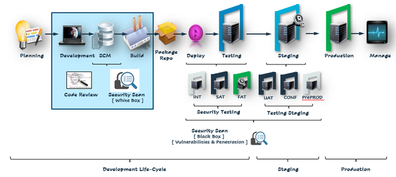

## Задание №2

 - Жизненный цикл ПО: 
 
 1. Жизненный цикл стартапа:
    - Планирование(менеджер->devops+разработчики)
    - Разработка(devops+разработчики)
    - Сборка(devops)
    - Тестирование(devops->тестировщики->разработчики)
    - Деплой(devops+разаботчики->менеджер)
    - Мониторинг(devops)
    - "Эволюция"(патчи, обновления) (менеджер->devops+разработчики)
