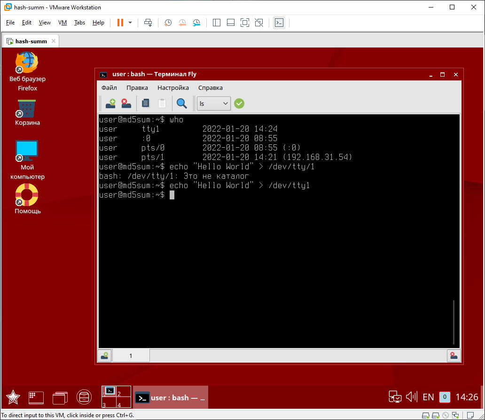
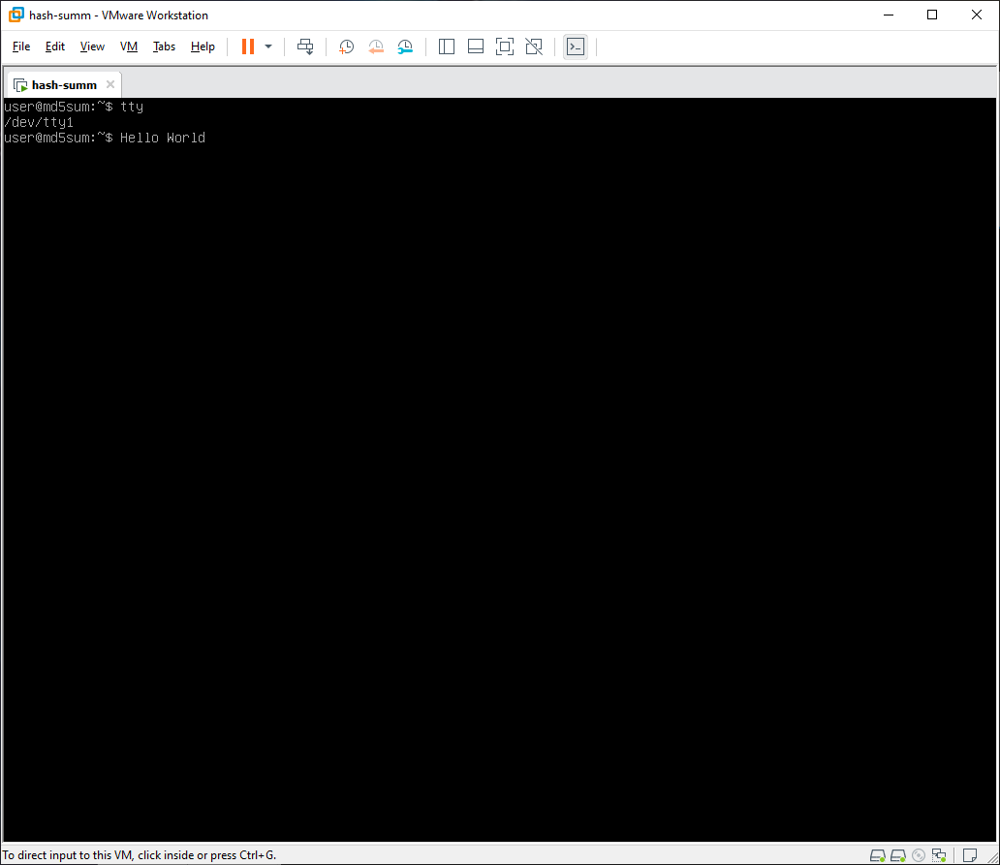

# Домашнее задание к занятию "3.2. Работа в терминале, лекция 2"

1. Какого типа команда `cd`? Попробуйте объяснить, почему она именно такого типа; опишите ход своих мыслей, если считаете что она могла бы быть другого типа.
    - `cd` - встроенная команда и может влиять на внутреннее состояние оболочки. Такие команды как cd должны быть встроенными, потому что внешняя программа не может изменить текущий каталог оболочки. Другие команды, например echo, могут быть встроены для эффективности, но нет внутренней причины, по которой они не могут быть внешними командами.
1. Какая альтернатива без pipe команде `grep <some_string> <some_file> | wc -l`? `man grep` поможет в ответе на этот вопрос. Ознакомьтесь с [документом](http://www.smallo.ruhr.de/award.html) о других подобных некорректных вариантах использования pipe.
    ```
   grep <some_string> <some_file> -c
    ```
1. Какой процесс с PID `1` является родителем для всех процессов в вашей виртуальной машине Ubuntu 20.04?
    ````
   pixel@pixel:~$ pstree -p
    systemd(1)─┬─VGAuthService(485)
               ├─agetty(557)
               ├─apache2(661)─┬─apache2(72358)
    ````   
1. Как будет выглядеть команда, которая перенаправит вывод stderr `ls` на другую сессию терминала?
    ```
    pixel@pixel:~$ who
    pixel    pts/0        2022-01-20 13:22 (192.168.31.54)
    pixel    pts/1        2022-01-20 13:25 (192.168.31.54)
    pixel@pixel:~$ ls -l /test 2>/dev/pts/1
    ```
    ```
    pixel@pixel:~$ ls: невозможно получить доступ к '/test': Нет такого файла или каталога

    ```
1. Получится ли одновременно передать команде файл на stdin и вывести ее stdout в другой файл? Приведите работающий пример.
    ```
    pixel@pixel:~$ echo "Hello World" >> test_in
    pixel@pixel:~$ cat < test_in > test_out
    pixel@pixel:~$ cat test_out
    Hello World
    ```
1. Получится ли находясь в графическом режиме, вывести данные из PTY в какой-либо из эмуляторов TTY? Сможете ли вы наблюдать выводимые данные?
   - Вполне. Вывод можно наблюдать переключаясь между терминалами Ctrl+Alt+{F1...F8} 
   - 
   - 
1. Выполните команду `bash 5>&1`. К чему она приведет? Что будет, если вы выполните `echo netology > /proc/$$/fd/5`? Почему так происходит?
    ```
    vagrant@debian-11:~$ bash 5>&1
    vagrant@debian-11:~$ echo netology > /proc/$$/fd/5
    netology
    ```
    - создали процесс `bash` с дескриптором 5 и перенаправили в stdout. Потом вызвали `echo` перенаправив вывод в процесс с дескриптором 5. Bash обработал команду echo.
1. Получится ли в качестве входного потока для pipe использовать только stderr команды, не потеряв при этом отображение stdout на pty? Напоминаем: по умолчанию через pipe передается только stdout команды слева от `|` на stdin команды справа. Это можно сделать, поменяв стандартные потоки местами через промежуточный новый дескриптор, который вы научились создавать в предыдущем вопросе.
    ```
    pixel@pixel:~$ cat text 5>&2 2>&1 1>&5 | grep text -c
    1
    pixel@pixel:~$ echo text >> text
    pixel@pixel:~$ cat text 5>&2 2>&1 1>&5 | grep text -c
    text
    0
    ```
1. Что выведет команда `cat /proc/$$/environ`? Как еще можно получить аналогичный по содержанию вывод?
    - `/proc/PID/environ` – переменные окружения для данного процесса. Можно вывести список командами `printenv` и `env`.

1. Используя `man`, опишите что доступно по адресам `/proc/<PID>/cmdline`, `/proc/<PID>/exe`.
    ```
    /proc/[pid]/cmdline 
              This  read-only  file  holds the complete command line for the process, unless the process is a zombie.  In the latter case, there is nothing in this file: that is, a read on
              this file will return 0 characters.  The command-line arguments appear in this file as a set of strings separated by null bytes ('\0'), with a further  null  byte  after  the
              last string.

              If, after an execve(2), the process modifies its argv strings, those changes will show up here.  This is not the same thing as modifying the argv array.

              Furthermore, a process may change the memory location that this file refers via prctl(2) operations such as PR_SET_MM_ARG_START.

              Think of this file as the command line that the process wants you to see.
    ```
    ```
    /proc/[pid]/exe
              Under Linux 2.2 and later, this file is a symbolic link containing the actual pathname of the executed command.  This symbolic link can be dereferenced  normally;  attempting
              to  open  it  will open the executable.  You can even type /proc/[pid]/exe to run another copy of the same executable that is being run by process [pid].  If the pathname has
              been unlinked, the symbolic link will contain the string '(deleted)' appended to the original pathname.  In a multithreaded process, the contents of this  symbolic  link  are
              not available if the main thread has already terminated (typically by calling pthread_exit(3)).

              Permission to dereference or read (readlink(2)) this symbolic link is governed by a ptrace access mode PTRACE_MODE_READ_FSCREDS check; see ptrace(2).

              Under  Linux  2.0 and earlier, /proc/[pid]/exe is a pointer to the binary which was executed, and appears as a symbolic link.  A readlink(2) call on this file under Linux 2.0
              returns a string in the format:

                  [device]:inode

              For example, [0301]:1502 would be inode 1502 on device major 03 (IDE, MFM, etc. drives) minor 01 (first partition on the first drive).

              find(1) with the -inum option can be used to locate the file.

    ```
1. Узнайте, какую наиболее старшую версию набора инструкций SSE поддерживает ваш процессор с помощью `/proc/cpuinfo`.
    - `cat /proc/cpuinfo` sse sse2 sse4a
1. При открытии нового окна терминала и `vagrant ssh` создается новая сессия и выделяется pty. Это можно подтвердить командой `tty`, которая упоминалась в лекции 3.2. Однако:

    ```
    vagrant@netology1:~$ ssh localhost 'tty'
    not a tty
    ```
	- Почитайте, почему так происходит, и как изменить поведение.
	
    ```
    vagrant@debian-11:~$ ssh localhost tty
    vagrant@localhost's password: 
    not a tty
    ```
	
	- Изменяется принудительным открытием терминала
	
	```
    vagrant@debian-11:~$ ssh -t localhost tty
    vagrant@localhost's password: 
    /dev/pts/1
    Connection to localhost closed.
    ```
1. Бывает, что есть необходимость переместить запущенный процесс из одной сессии в другую. Попробуйте сделать это, воспользовавшись `reptyr`. Например, так можно перенести в `screen` процесс, который вы запустили по ошибке в обычной SSH-сессии.
    - `screen` на debian 11 не заработал, пришлось поставить `tmux`. Создал процесс `top`, остановил, убрал в фон и перенес в `tmux`.
    
1. `sudo echo string > /root/new_file` не даст выполнить перенаправление под обычным пользователем, так как перенаправлением занимается процесс shell'а, который запущен без `sudo` под вашим пользователем. Для решения данной проблемы можно использовать конструкцию `echo string | sudo tee /root/new_file`. Узнайте что делает команда `tee` и почему в отличие от `sudo echo` команда с `sudo tee` будет работать.
     - Перенаправление вывода происходит не под рутом, поэтому создать `new_file` в директории root не получится. Если использовать `echo string | sudo tee /root/new_file` тогда `tee` запущенная под sudo получит вывод echo, создаст файл в директории root и выведет результат в stdout