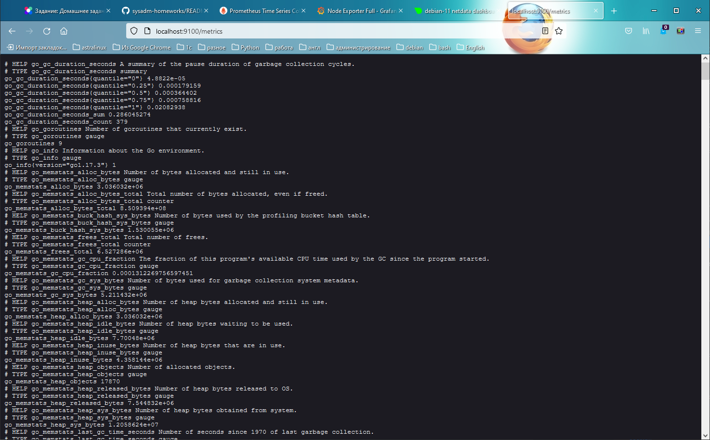
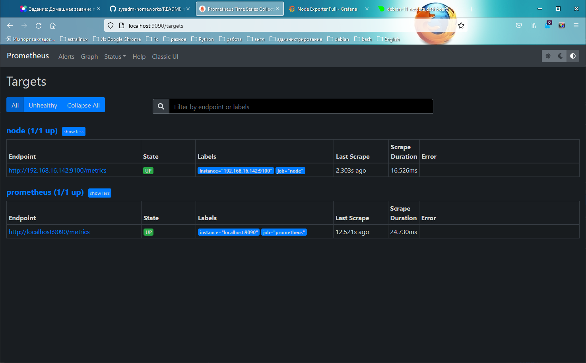
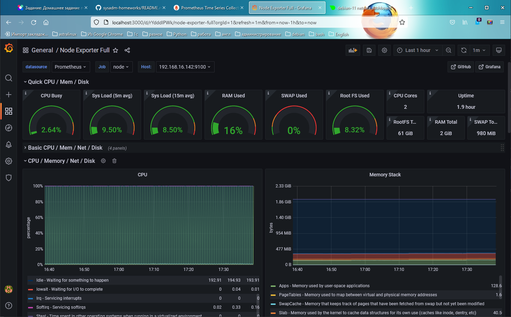
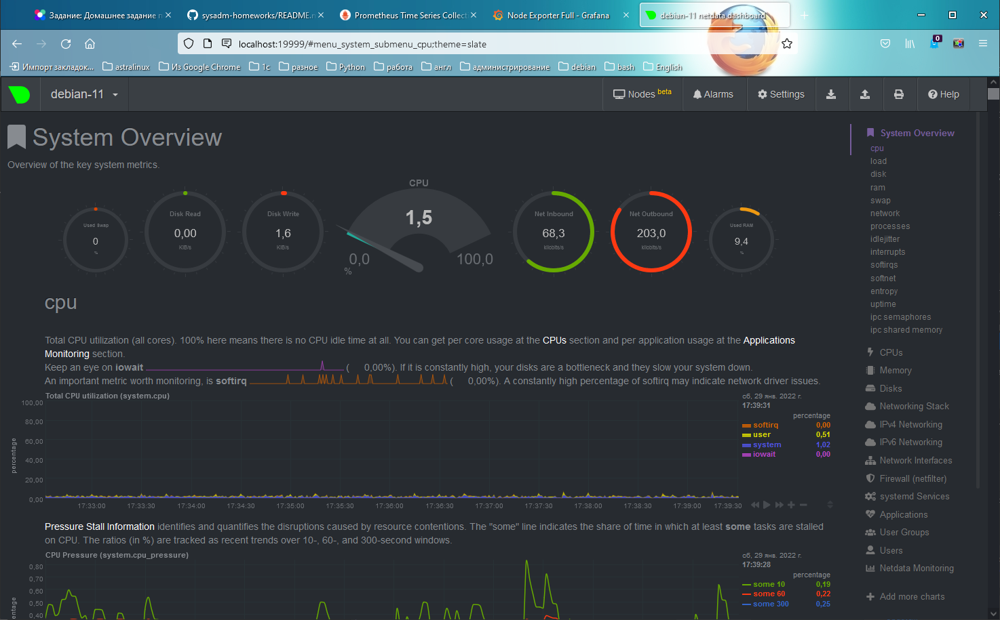
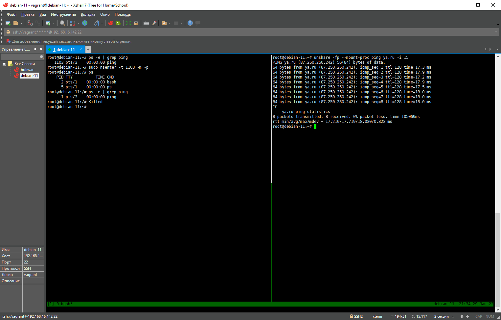

# Домашнее задание к занятию "3.4. Операционные системы, лекция 2"

1. На лекции мы познакомились с [node_exporter](https://github.com/prometheus/node_exporter/releases). В демонстрации его исполняемый файл запускался в background. Этого достаточно для демо, но не для настоящей production-системы, где процессы должны находиться под внешним управлением. Используя знания из лекции по systemd, создайте самостоятельно простой [unit-файл](https://www.freedesktop.org/software/systemd/man/systemd.service.html) для node_exporter:

    * поместите его в автозагрузку,
    * предусмотрите возможность добавления опций к запускаемому процессу через внешний файл (посмотрите, например, на `systemctl cat cron`),
    * удостоверьтесь, что с помощью systemctl процесс корректно стартует, завершается, а после перезагрузки автоматически поднимается.
    ```
    vagrant@debian-11:~$ sudo useradd --system --no-create-home --shell /bin/false node_exporter
    vagrant@debian-11:~$ wget https://github.com/prometheus/node_exporter/releases/download/v1.3.1/node_exporter-1.3.1.linux-amd64.tar.gz
    vagrant@debian-11:~$ tar -xvf node_exporter-1.3.1.linux-amd64.tar.gz
    vagrant@debian-11:~$ sudo mv node_exporter-1.3.1.linux-amd64/node_exporter /usr/local/bin
    vagrant@debian-11:/bin$ sudo nano /etc/systemd/system/node_exporter.service
    vagrant@debian-11:/bin$ cat /etc/systemd/system/node_exporter.service
    [Unit]
    Description=Node Exporter
    Wants=network-online.target
    After=network-online.target
    
    StartLimitIntervalSec=500
    StartLimitBurst=5
    
    [Service]
    User=node_exporter
    Group=node_exporter
    Type=simple
    Restart=on-failure
    RestartSec=5s
    EnvironmentFile=/etc/sysconfig/node_exporter
    ExecStart=/usr/local/bin/node_exporter $OPTIONS
    
    [Install]
    WantedBy=multi-user.target
    
    vagrant@debian-11:~$ sudo mkdir -p /etc/sysconfig
    vagrant@debian-11:~$ sudo touch /etc/sysconfig/node_exporter
    vagrant@debian-11:~$ sudo systemctl daemon-reload
    vagrant@debian-11:~$ sudo systemctl enable node_exporter
    vagrant@debian-11:~$ sudo systemctl start node_exporter
    vagrant@debian-11:~$ sudo systemctl status node_exporter
    ● node_exporter.service - Node Exporter
        Loaded: loaded (/etc/systemd/system/node_exporter.service; enabled; vendor preset: enabled)
        Active: active (running) since Tue 2022-01-25 18:54:31 UTC; 3min 3s ago
     Main PID: 413 (node_exporter)
        Tasks: 5 (limit: 2336)
     Memory: 21.2M
        CPU: 45ms
     CGroup: /system.slice/node_exporter.service
             └─413 /usr/local/bin/node_exporter

    Jan 25 18:54:31 debian-11 node_exporter[413]: ts=2022-01-25T18:54:31.218Z caller=node_exporter.go:115 level=info collector=thermal_zone
    Jan 25 18:54:31 debian-11 node_exporter[413]: ts=2022-01-25T18:54:31.218Z caller=node_exporter.go:115 level=info collector=time
    Jan 25 18:54:31 debian-11 node_exporter[413]: ts=2022-01-25T18:54:31.218Z caller=node_exporter.go:115 level=info collector=timex
    Jan 25 18:54:31 debian-11 node_exporter[413]: ts=2022-01-25T18:54:31.218Z caller=node_exporter.go:115 level=info collector=udp_queues
    Jan 25 18:54:31 debian-11 node_exporter[413]: ts=2022-01-25T18:54:31.219Z caller=node_exporter.go:115 level=info collector=uname
    Jan 25 18:54:31 debian-11 node_exporter[413]: ts=2022-01-25T18:54:31.219Z caller=node_exporter.go:115 level=info collector=vmstat
    Jan 25 18:54:31 debian-11 node_exporter[413]: ts=2022-01-25T18:54:31.219Z caller=node_exporter.go:115 level=info collector=xfs
    Jan 25 18:54:31 debian-11 node_exporter[413]: ts=2022-01-25T18:54:31.219Z caller=node_exporter.go:115 level=info collector=zfs
    Jan 25 18:54:31 debian-11 node_exporter[413]: ts=2022-01-25T18:54:31.219Z caller=node_exporter.go:199 level=info msg="Listening on" address=:9100
    Jan 25 18:54:31 debian-11 node_exporter[413]: ts=2022-01-25T18:54:31.219Z caller=tls_config.go:195 level=info msg="TLS is disabled." http2=false
    
   vagrant@debian-11:~$ sudo ss -pnltu
    Netid         State          Recv-Q         Send-Q                 Local Address:Port                 Peer Address:Port         Process                                                           
    udp           UNCONN         0              0                            0.0.0.0:68                        0.0.0.0:*             users:(("dhclient",pid=444,fd=9))                                
    udp           UNCONN         0              0                            0.0.0.0:111                       0.0.0.0:*             users:(("rpcbind",pid=360,fd=5),("systemd",pid=1,fd=37))         
    udp           UNCONN         0              0                               [::]:111                          [::]:*             users:(("rpcbind",pid=360,fd=7),("systemd",pid=1,fd=39))         
    tcp           LISTEN         0              128                          0.0.0.0:22                        0.0.0.0:*             users:(("sshd",pid=436,fd=3))                                    
    tcp           LISTEN         0              4096                         0.0.0.0:111                       0.0.0.0:*             users:(("rpcbind",pid=360,fd=4),("systemd",pid=1,fd=36))         
    tcp           LISTEN         0              128                             [::]:22                           [::]:*             users:(("sshd",pid=436,fd=4))                                    
    tcp           LISTEN         0              4096                               *:9100                            *:*             users:(("node_exporter",pid=413,fd=3))                           
    tcp           LISTEN         0              4096                            [::]:111                          [::]:*             users:(("rpcbind",pid=360,fd=6),("systemd",pid=1,fd=38))
    ```
    - CPU: system, user покажут время, использованное системой и программами; слишком высокий steal будет означать, что гипервизор перегружен и процессор занят другими ВМ; iowait - поможет отследить, всё ли в порядке с дисковой системой.  
    ```shell
    # TYPE node_cpu_seconds_total counter
    node_cpu_seconds_total{cpu="0",mode="idle"} 27.36
    node_cpu_seconds_total{cpu="0",mode="iowait"} 0.52
    node_cpu_seconds_total{cpu="0",mode="irq"} 0
    node_cpu_seconds_total{cpu="0",mode="nice"} 0
    node_cpu_seconds_total{cpu="0",mode="softirq"} 0.17
    node_cpu_seconds_total{cpu="0",mode="steal"} 0
    node_cpu_seconds_total{cpu="0",mode="system"} 3.47
    node_cpu_seconds_total{cpu="0",mode="user"} 2.96
    node_cpu_seconds_total{cpu="1",mode="idle"} 28.92
    node_cpu_seconds_total{cpu="1",mode="iowait"} 0.2
    node_cpu_seconds_total{cpu="1",mode="irq"} 0
    node_cpu_seconds_total{cpu="1",mode="nice"} 0
    node_cpu_seconds_total{cpu="1",mode="softirq"} 0.21
    node_cpu_seconds_total{cpu="1",mode="steal"} 0
    node_cpu_seconds_total{cpu="1",mode="system"} 2.66
    node_cpu_seconds_total{cpu="1",mode="user"} 2.34
    ```
    - MEM: MemTotal - количество памяти; MemFree и MemAvailable - свободная и доступная память; SwapTotal, SwapFree, SwapCached - своп, если слишком много занято -- RAM не хватает.

    ```shell
    # TYPE node_memory_MemAvailable_bytes gauge
    node_memory_MemAvailable_bytes 7.43829504e+08
    # TYPE node_memory_MemFree_bytes gauge
    node_memory_MemFree_bytes 6.51558912e+08
    # TYPE node_memory_MemTotal_bytes gauge
    node_memory_MemTotal_bytes 1.028694016e+09
    # TYPE node_memory_SwapCached_bytes gauge
    node_memory_SwapCached_bytes 0
    # TYPE node_memory_SwapFree_bytes gauge
    node_memory_SwapFree_bytes 1.027600384e+09
    # TYPE node_memory_SwapTotal_bytes gauge
    node_memory_SwapTotal_bytes 1.027600384e+09
    ```

    - DISK: size_bytes и avail_bytes покажут объём и свободное место; readonly=1 может говорить о проблемах ФС, из-за чего она перешла в режим только для чтения; io_now - интенсивность работы с диском в текущий момент.
    ```shell
    # TYPE node_filesystem_avail_bytes gauge
    node_filesystem_avail_bytes 6.0764639232e+10
    # TYPE node_filesystem_readonly gauge
    node_filesystem_readonly 0
    # TYPE node_filesystem_size_bytes gauge
    node_filesystem_size_bytes 6.5827115008e+10
    # TYPE node_disk_io_now gauge
    node_disk_io_now{device="sda"} 0
    ```

    - NET: carrier_down, carrier_up - если много, значит проблема с физическим подключением; info - общая информация по интерфейсу; mtu_bytes - может быть важно для диагностики потерь или если трафик хостов не проходит через маршрутизатор; receive_errs_total, transmit_errs_total, receive_packets_total, transmit_packets_total - ошибки передачи, в зависимости от объёма, вероятно какие-то проблемы сети или с хостом
    ```shell
    # TYPE node_network_carrier_down_changes_total counter
    node_network_carrier_down_changes_total{device="eth0"} 1
    # TYPE node_network_carrier_up_changes_total counter
    node_network_carrier_up_changes_total{device="eth0"} 1
    # TYPE node_network_info gauge
    node_network_info 1
    # TYPE node_network_mtu_bytes gauge
    node_network_mtu_bytes{device="eth0"} 1500
    # TYPE node_network_receive_errs_total counter
    node_network_receive_errs_total{device="eth0"} 0
    # TYPE node_network_receive_packets_total counter
    node_network_receive_packets_total{device="eth0"} 351
    # TYPE node_network_transmit_errs_total counter
    node_network_transmit_errs_total{device="eth0"} 0
    # TYPE node_network_transmit_packets_total counter
    node_network_transmit_packets_total{device="eth0"} 279
    ```
    - Все эти значения можно подсмотреть в Grafana. Там языком Grafana метрики представлены в читаемом виде.

1. Ознакомьтесь с опциями node_exporter и выводом `/metrics` по-умолчанию. Приведите несколько опций, которые вы бы выбрали для базового мониторинга хоста по CPU, памяти, диску и сети.
    
    
    
    
    
    
1. Установите в свою виртуальную машину [Netdata](https://github.com/netdata/netdata). Воспользуйтесь [готовыми пакетами](https://packagecloud.io/netdata/netdata/install) для установки (`sudo apt install -y netdata`). После успешной установки:
    * в конфигурационном файле `/etc/netdata/netdata.conf` в секции [web] замените значение с localhost на `bind to = 0.0.0.0`,
    * добавьте в Vagrantfile проброс порта Netdata на свой локальный компьютер и сделайте `vagrant reload`:

    ```bash
    config.vm.network "forwarded_port", guest: 19999, host: 19999
    ```

    После успешной перезагрузки в браузере *на своем ПК* (не в виртуальной машине) вы должны суметь зайти на `localhost:19999`. Ознакомьтесь с метриками, которые по умолчанию собираются Netdata и с комментариями, которые даны к этим метрикам.
    
    
    
1. Можно ли по выводу `dmesg` понять, осознает ли ОС, что загружена не на настоящем оборудовании, а на системе виртуализации?
    ```
    DMI: VMware, Inc. VMware Virtual Platform/440BX Desktop Reference Platform, BIOS 6.00 07/22/2020
    [    0.000000] vmware: hypercall mode: 0x00
    [    0.000000] Hypervisor detected: VMware
    [    0.000000] vmware: TSC freq read from hypervisor : 3616.494 MHz
    [    0.000000] vmware: Host bus clock speed read from hypervisor : 66000000 Hz
    [    0.000000] vmware: using clock offset of 14421851438 ns
    ```
   - Ядро при загрузке видит гипервизор. Но можно проще `systemd-detect-virt`
   
1. Как настроен sysctl `fs.nr_open` на системе по-умолчанию? Узнайте, что означает этот параметр. Какой другой существующий лимит не позволит достичь такого числа (`ulimit --help`)?
    ```
    vagrant@debian-11:~$ /sbin/sysctl -n fs.nr_open
    1048576
    vagrant@debian-11:~$ ulimit -Sn
    1024
    vagrant@debian-11:~$ ulimit -Hn
    1048576
    vagrant@debian-11:~$ cat /proc/sys/fs/file-max
    9223372036854775807
    ```
     
     - `fs.nr_open` - это лимит на количество открытых дескрипторов. `ulimit -Sn` - мягкий (изменяемый) лимит для пользователя. `ulimit -Hn` - жесткое ограничение. `file-max` - максимальное количество открытых файлов.
     
1. Запустите любой долгоживущий процесс (не `ls`, который отработает мгновенно, а, например, `sleep 1h`) в отдельном неймспейсе процессов; покажите, что ваш процесс работает под PID 1 через `nsenter`. Для простоты работайте в данном задании под root (`sudo -i`). Под обычным пользователем требуются дополнительные опции (`--map-root-user`) и т.д.
    
1. Найдите информацию о том, что такое `:(){ :|:& };:`. Запустите эту команду в своей виртуальной машине Vagrant с Ubuntu 20.04 (**это важно, поведение в других ОС не проверялось**). Некоторое время все будет "плохо", после чего (минуты) – ОС должна стабилизироваться. Вызов `dmesg` расскажет, какой механизм помог автоматической стабилизации. Как настроен этот механизм по-умолчанию, и как изменить число процессов, которое можно создать в сессии?
    - fork бомба. Это функция, которая параллельно пускает два своих экземпляра. Каждый пускает ещё по два и т.д. Будет работать пока не кончатся PID.
    - в моей debian 11 система виснет полностью забив память и процессор выдавая бесконечно:
   ```
    -bash: fork: retry: Resource temporarily unavailable
   ```
   - Не помогает ни изменение `ulimit -u` ни `ulimit -n`.