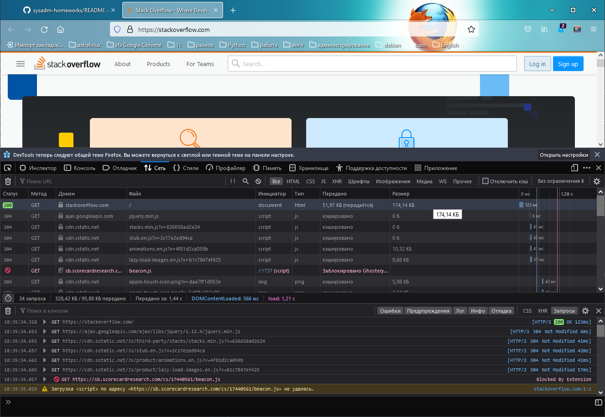

# Домашнее задание к занятию "3.6. Компьютерные сети, лекция 1"

1. Работа c HTTP через телнет.
- Подключитесь утилитой телнет к сайту stackoverflow.com `telnet stackoverflow.com 80`
- отправьте HTTP запрос
```bash
GET /questions HTTP/1.0
HOST: stackoverflow.com
[press enter]
[press enter]
```
```
vagrant@debian-11:~$ telnet stackoverflow.com 80
Trying 151.101.129.69...
Connected to stackoverflow.com.
Escape character is '^]'.
GET /questions HTTP/1.0
HOST: stackoverflow.com

HTTP/1.1 301 Moved Permanently
cache-control: no-cache, no-store, must-revalidate
location: https://stackoverflow.com/questions
x-request-guid: 773b7096-cbfc-4869-8da4-bb41f2a0f5f2
feature-policy: microphone 'none'; speaker 'none'
content-security-policy: upgrade-insecure-requests; frame-ancestors 'self' https://stackexchange.com
Accept-Ranges: bytes
Date: Sat, 12 Feb 2022 08:14:42 GMT
Via: 1.1 varnish
Connection: close
X-Served-By: cache-hhn4029-HHN
X-Cache: MISS
X-Cache-Hits: 0
X-Timer: S1644653682.895385,VS0,VE155
Vary: Fastly-SSL
X-DNS-Prefetch-Control: off
Set-Cookie: prov=4a5717bf-fbd4-df86-a958-dfa538d5c841; domain=.stackoverflow.com; expires=Fri, 01-Jan-2055 00:00:00 GMT; path=/; HttpOnly

Connection closed by foreign host.
```

- В ответе укажите полученный HTTP код, что он означает?

`HTTP/1.1 301 Moved Permanently` - Код перенаправления протокола передачи гипертекста (HTTP) показывает, что запрошенный ресурс был окончательно перемещён в URL, указанный в заголовке Location (en-US). Браузер в случае такого ответа перенаправляется на эту страницу, а поисковые системы обновляют свои ссылки на ресурс.

2. Повторите задание 1 в браузере, используя консоль разработчика F12.
- откройте вкладку `Network`
- отправьте запрос http://stackoverflow.com
- найдите первый ответ HTTP сервера, откройте вкладку `Headers`
```
scheme	  https
host	  stackoverflow.com
filename  /
Адрес     151.101.1.69:443
Состояние 200 OK
Версия    HTTP/2
Передано  51,97 КБ (размер 174,14 КБ)
Referrer  policyno-referrer-when-downgrade
```

- укажите в ответе полученный HTTP код.

200


- проверьте время загрузки страницы, какой запрос обрабатывался дольше всего?

Время загрузки 1.28 с, самый долгий запрос - загрузка страницы HTML 123 мс

- приложите скриншот консоли браузера в ответ.



3. Какой IP адрес у вас в интернете?

- Выделенный провайдером платный "белый" IP

4. Какому провайдеру принадлежит ваш IP адрес? Какой автономной системе AS? Воспользуйтесь утилитой `whois`
```
vagrant@debian-11:~$ whois 46.32.*.* | grep descr
descr:          IP addresses used to connect an end user
descr:          INFO-LAN Network
```
```
vagrant@debian-11:~$ whois 46.32.*.* | grep origin
origin:         AS48416
```

5. Через какие сети проходит пакет, отправленный с вашего компьютера на адрес 8.8.8.8? Через какие AS? Воспользуйтесь утилитой `traceroute`
```
vagrant@debian-11:~/.ssh$ traceroute -A4 8.8.8.8
traceroute to 8.8.8.8 (8.8.8.8), 30 hops max, 60 byte packets
 1  192.168.0.1 (192.168.0.1) [*]  3.012 ms  2.897 ms  2.847 ms
 2  172.23.63.254 (172.23.63.254) [*]  2.800 ms  2.752 ms  2.706 ms
 3  * * *
 4  109.239.136.60 (109.239.136.60) [AS31500]  2.509 ms  2.460 ms  2.460 ms
 5  74.125.244.180 (74.125.244.180) [AS15169]  2.413 ms  150.610 ms 74.125.244.132 (74.125.244.132) [AS15169]  3.697 ms
 6  72.14.232.85 (72.14.232.85) [AS15169]  3.648 ms  3.873 ms 142.251.61.219 (142.251.61.219) [AS15169]  5.928 ms
 7  142.251.61.221 (142.251.61.221) [AS15169]  8.156 ms  7.913 ms 172.253.51.219 (172.253.51.219) [AS15169]  7.676 ms
 8  216.239.63.65 (216.239.63.65) [AS15169]  10.772 ms * 142.250.209.161 (142.250.209.161) [AS15169]  6.946 ms
 9  * * *
10  * * *
11  * * *
12  * * *
13  * * *
14  * * *
15  * * *
16  * * *
17  * dns.google (8.8.8.8) [AS15169]  6.320 ms *
```
Пакеты проходят через `AS31500` (GLOBALNET) и  `AS15169` (Google).


6. Повторите задание 5 в утилите `mtr`. На каком участке наибольшая задержка - delay?
```
vagrant@debian-11:~$ mtr 8.8.8.8 -znrc 1
Start: 2022-02-12T22:59:47+0300
HOST: debian-11                   Loss%   Snt   Last   Avg  Best  Wrst StDev
  1. AS???    192.168.0.1          0.0%     1    1.0   1.0   1.0   1.0   0.0
  2. AS???    172.23.63.254        0.0%     1    1.1   1.1   1.1   1.1   0.0
  3. AS???    ???                 100.0     1    0.0   0.0   0.0   0.0   0.0
  4. AS???    109.239.136.60       0.0%     1    1.9   1.9   1.9   1.9   0.0
  5. AS15169  74.125.244.132       0.0%     1    2.1   2.1   2.1   2.1   0.0
  6. AS15169  72.14.232.85         0.0%     1    2.3   2.3   2.3   2.3   0.0
  7. AS15169  142.251.51.187       0.0%     1    5.8   5.8   5.8   5.8   0.0
  8. AS15169  209.85.254.179       0.0%     1    5.7   5.7   5.7   5.7   0.0
  9. AS???    ???                 100.0     1    0.0   0.0   0.0   0.0   0.0
 10. AS???    ???                 100.0     1    0.0   0.0   0.0   0.0   0.0
 11. AS???    ???                 100.0     1    0.0   0.0   0.0   0.0   0.0
 12. AS???    ???                 100.0     1    0.0   0.0   0.0   0.0   0.0
 13. AS???    ???                 100.0     1    0.0   0.0   0.0   0.0   0.0
 14. AS???    ???                 100.0     1    0.0   0.0   0.0   0.0   0.0
 15. AS???    ???                 100.0     1    0.0   0.0   0.0   0.0   0.0
 16. AS???    ???                 100.0     1    0.0   0.0   0.0   0.0   0.0
 17. AS???    ???                 100.0     1    0.0   0.0   0.0   0.0   0.0
 18. AS15169  8.8.8.8              0.0%     1    5.5   5.5   5.5   5.5   0.0
```
Самая большая задерка 5.8 с на 7 узле.

7. Какие DNS сервера отвечают за доменное имя dns.google? Какие A записи? воспользуйтесь утилитой `dig`
```
vagrant@debian-11:~$ dig dns.google NS +noall +answer
dns.google.		5	IN	NS	ns3.zdns.google.
dns.google.		5	IN	NS	ns2.zdns.google.
dns.google.		5	IN	NS	ns4.zdns.google.
dns.google.		5	IN	NS	ns1.zdns.google.
```
```
vagrant@debian-11:~$ dig dns.google A +noall +answer
dns.google.		5	IN	A	8.8.4.4
dns.google.		5	IN	A	8.8.8.8

```

8. Проверьте PTR записи для IP адресов из задания 7. Какое доменное имя привязано к IP? воспользуйтесь утилитой `dig`
```
vagrant@debian-11:~$ for ip in `dig dns.google A +short`; do dig -x $ip +noall +answer; done
4.4.8.8.in-addr.arpa.	5	IN	PTR	dns.google.
8.8.8.8.in-addr.arpa.	5	IN	PTR	dns.google.

```
