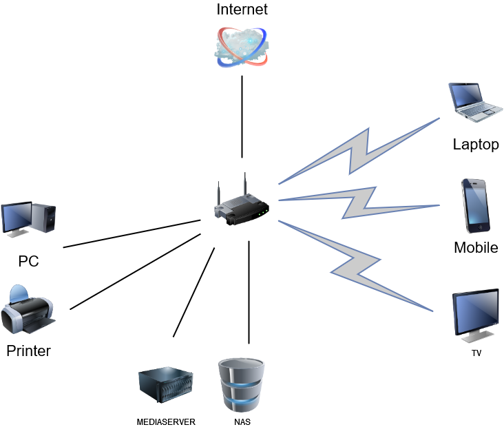

### Домашнее задание к занятию "3.8. Компьютерные сети, лекция 3"  

1. Подключитесь к публичному маршрутизатору в интернет. Найдите маршрут к вашему публичному IP
    ```
    telnet route-views.routeviews.org
    Username: rviews
    show ip route x.x.x.x/32
    show bgp x.x.x.x/32
    ```
    ```
    route-views>show ip route  46.32.*.*
    Routing entry for 46.32.*.0/22
      Known via "bgp 6447", distance 20, metric 0
      Tag 3303, type external
      Last update from 217.192.89.50 4d20h ago
      Routing Descriptor Blocks:
      * 217.192.89.50, from 217.192.89.50, 4d20h ago
          Route metric is 0, traffic share count is 1
          AS Hops 5
          Route tag 3303
          MPLS label: none
    ```
    ```
    route-views>show bgp  46.32.*.*
    BGP routing table entry for 46.32.*.*/22, version 311285825
    Paths: (22 available, best #13, table default)
      Not advertised to any peer
      Refresh Epoch 1
      8283 31500 48416 48416 48416
        94.142.247.3 from 94.142.247.3 (94.142.247.3)
          Origin IGP, metric 0, localpref 100, valid, external
          Community: 8283:1 8283:101
          unknown transitive attribute: flag 0xE0 type 0x20 length 0x18
            value 0000 205B 0000 0000 0000 0001 0000 205B
                  0000 0005 0000 0001 
          path 7FE09E844B28 RPKI State not found
          rx pathid: 0, tx pathid: 0
      Refresh Epoch 1
      57866 3356 31500 48416 48416 48416
        37.139.139.17 from 37.139.139.17 (37.139.139.17)
          Origin IGP, metric 0, localpref 100, valid, external
          Community: 3356:2 3356:22 3356:100 3356:123 3356:507 3356:903 3356:2111 65000:8402
          path 7FE0F1F7DD30 RPKI State not found
          rx pathid: 0, tx pathid: 0
      Refresh Epoch 1
      852 31133 48416 48416 48416 48416
        154.11.12.212 from 154.11.12.212 (96.1.209.43)
          Origin IGP, metric 0, localpref 100, valid, external
          path 7FE0D1C0F928 RPKI State not found
          rx pathid: 0, tx pathid: 0
      Refresh Epoch 1
      20130 23352 2914 3356 31500 48416 48416 48416
        140.192.8.16 from 140.192.8.16 (140.192.8.16)
          Origin IGP, localpref 100, valid, external
          path 7FE1497557B8 RPKI State not found
          rx pathid: 0, tx pathid: 0
      Refresh Epoch 1
      1351 6939 50509 48416 48416 48416 48416 48416 48416 48416 48416 48416
        132.198.255.253 from 132.198.255.253 (132.198.255.253)
          Origin IGP, localpref 100, valid, external
          path 7FE184CC0928 RPKI State not found
     --More-- Connection closed by foreign host.
    ```

2. Создайте dummy0 интерфейс в Ubuntu. Добавьте несколько статических маршрутов. Проверьте таблицу маршрутизации.
    
    #####Запуск модуля
    ```
    root@ubuntu-20:~# ip link
    1: lo: <LOOPBACK,UP,LOWER_UP> mtu 65536 qdisc noqueue state UNKNOWN mode DEFAULT group default qlen 1000
        link/loopback 00:00:00:00:00:00 brd 00:00:00:00:00:00
    2: ens3: <BROADCAST,MULTICAST,UP,LOWER_UP> mtu 1500 qdisc fq_codel state UP mode DEFAULT group default qlen 1000
        link/ether 00:50:00:00:03:00 brd ff:ff:ff:ff:ff:ff
    root@ubuntu-20:~# ip link add name vr-br type dummy
    root@ubuntu-20:~# ip link
    1: lo: <LOOPBACK,UP,LOWER_UP> mtu 65536 qdisc noqueue state UNKNOWN mode DEFAULT group default qlen 1000
        link/loopback 00:00:00:00:00:00 brd 00:00:00:00:00:00
    2: ens3: <BROADCAST,MULTICAST,UP,LOWER_UP> mtu 1500 qdisc fq_codel state UP mode DEFAULT group default qlen 1000
        link/ether 00:50:00:00:03:00 brd ff:ff:ff:ff:ff:ff
    4: vr-br: <BROADCAST,NOARP> mtu 1500 qdisc noop state DOWN mode DEFAULT group default qlen 1000
        link/ether de:ef:26:db:94:a8 brd ff:ff:ff:ff:ff:ff
    root@ubuntu-20:~# cat << "EOF" >> /etc/systemd/network/vr-br.network
    > [Match]
    > Name=vr-br
    > 
    > [Network]
    > Address=172.16.0.5/24
    > EOF
    root@ubuntu-20:~# cat << "EOF" >> /etc/systemd/network/vr-br.netdev
    > [NetDev]
    > Name=vr-br
    > Kind=dummy
    > EOF
    root@ubuntu-20:~# systemctl restart systemd-networkd
    root@ubuntu-20:~# ip a
    1: lo: <LOOPBACK,UP,LOWER_UP> mtu 65536 qdisc noqueue state UNKNOWN group default qlen 1000
        link/loopback 00:00:00:00:00:00 brd 00:00:00:00:00:00
        inet 127.0.0.1/8 scope host lo
           valid_lft forever preferred_lft forever
        inet6 ::1/128 scope host 
           valid_lft forever preferred_lft forever
    2: ens3: <BROADCAST,MULTICAST,UP,LOWER_UP> mtu 1500 qdisc fq_codel state UP group default qlen 1000
        link/ether 00:50:00:00:03:00 brd ff:ff:ff:ff:ff:ff
        inet 10.0.3.10/24 brd 10.0.3.255 scope global ens3
           valid_lft forever preferred_lft forever
        inet6 fe80::250:ff:fe00:300/64 scope link 
           valid_lft forever preferred_lft forever
    4: vr-br: <BROADCAST,NOARP,UP,LOWER_UP> mtu 1500 qdisc noqueue state UNKNOWN group default qlen 1000
        link/ether de:ef:26:db:94:a8 brd ff:ff:ff:ff:ff:ff
        inet 172.16.0.5/24 brd 172.16.0.255 scope global vr-br
           valid_lft forever preferred_lft forever
        inet6 fe80::dcef:26ff:fedb:94a8/64 scope link 
           valid_lft forever preferred_lft forever
    ```
    #####Добавление статического маршрута
    ```
    root@ubuntu-20:~# nano /etc/netplan/00-installer-config.yaml
    network:
      version: 2
      renderer: networkd
      ethernets:
        ens3:
          addresses:
              - 10.0.3.10/24
          gateway4: 10.0.3.1
          nameservers:
            addresses: [ 10.0.3.1 ]
          routes:
              - to: 10.0.10.0/24
                via: 10.0.3.10
    
    ```
    #####Таблица маршрутизации
    ```
    root@ubuntu-20:~# ip r
    default via 10.0.3.1 dev ens3 proto static 
    10.0.3.0/24 dev ens3 proto kernel scope link src 10.0.3.10 
    10.0.10.0/24 via 10.0.3.10 dev ens3 proto static 
    172.16.0.0/24 dev vr-br proto kernel scope link src 172.16.0.5 
    ```

3. Проверьте открытые TCP порты в Ubuntu, какие протоколы и приложения используют эти порты? Приведите несколько примеров.
    
   ```
    State        Recv-Q       Send-Q             Local Address:Port              Peer Address:Port       Process                                          
    LISTEN       0            4096               127.0.0.53%lo:53                     0.0.0.0:*           users:(("systemd-resolve",pid=584,fd=13))       
    LISTEN       0            128                      0.0.0.0:22                     0.0.0.0:*           users:(("sshd",pid=652,fd=3))                   
    LISTEN       0            128                    127.0.0.1:6010                   0.0.0.0:*           users:(("sshd",pid=1159,fd=11))                 
    LISTEN       0            128                         [::]:22                        [::]:*           users:(("sshd",pid=652,fd=4))                   
    LISTEN       0            128                        [::1]:6010                      [::]:*           users:(("sshd",pid=1159,fd=10))                 
   ```
    :53 - DNS  
    :22 - SSH

4. Проверьте используемые UDP сокеты в Ubuntu, какие протоколы и приложения используют эти порты?
    ```
    root@ubuntu-20:~# ss -unap
    State            Recv-Q           Send-Q                       Local Address:Port                       Peer Address:Port           Process           
    UNCONN           0                0                            127.0.0.53%lo:53                              0.0.0.0:*               users:(("systemd-resolve",pid=584,fd=12))
    ```
    :53 - DNS  

5. Используя diagrams.net, создайте L3 диаграмму вашей домашней сети или любой другой сети, с которой вы работали.
    - 