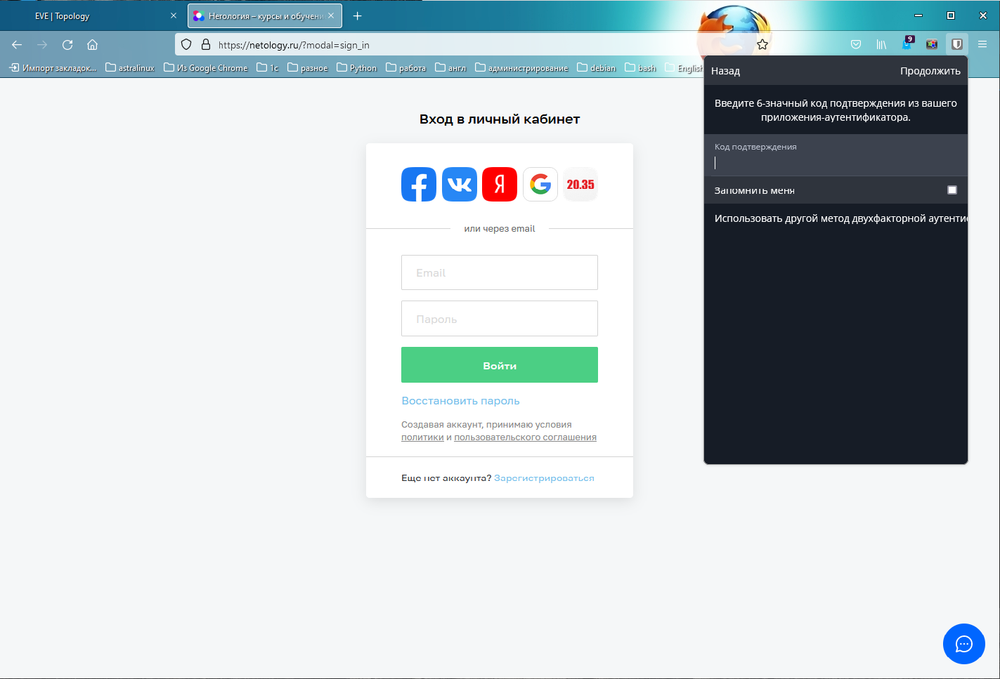
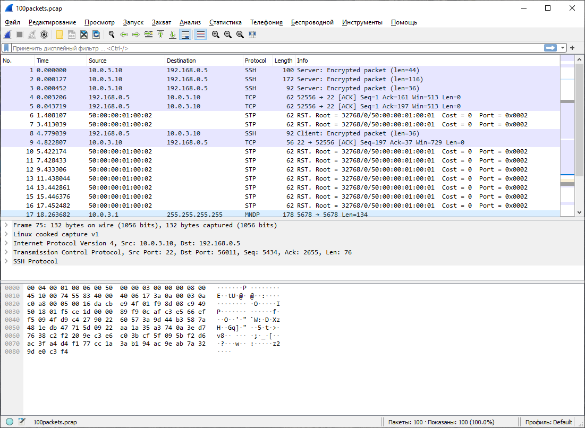

### Домашнее задание к занятию "3.9. Элементы безопасности информационных систем"

1. Установите Bitwarden плагин для браузера. Зарегистрируйтесь и сохраните несколько паролей.
    
2. Установите Google authenticator на мобильный телефон. Настройте вход в Bitwarden аккаунт через Google authenticator OTP.
    
3. Установите apache2, сгенерируйте самоподписанный сертификат, настройте тестовый сайт для работы по HTTPS.
    - Установка apache
    ```
    $ sudo apt install apache2
    ```
    - Создание виртуального хоста
    ```
    root@ubuntu-20:~# mkdir /var/www/test_site
    root@ubuntu-20:~# chown -R $USER:$USER /var/www/test_site
    root@ubuntu-20:~# chmod -R 755 /var/www/test_site
    root@ubuntu-20:~# nano /var/www/test_site/index.html
    root@ubuntu-20:~# cat /var/www/test_site/index.html
    <html>
        <head>
            <title>Welcome to Test site!</title>
        </head>
        <body>
            <h1>Success!  The test site virtual host is working!</h1>
        </body>
    </html>
    root@ubuntu-20:~# nano /etc/apache2/sites-available/test_site.conf
    root@ubuntu-20:~# cat /etc/apache2/sites-available/test_site.conf
    <VirtualHost *:80>
        ServerAdmin webmaster@localhost
        ServerName test_site
        ServerAlias www.test_site
        DocumentRoot /var/www/test_site
        ErrorLog ${APACHE_LOG_DIR}/error.log
        CustomLog ${APACHE_LOG_DIR}/access.log combined
    </VirtualHost>
    root@ubuntu-20:~# a2ensite test_site.conf
    Enabling site test_site.
    To activate the new configuration, you need to run:
      systemctl reload apache2
    root@ubuntu-20:~# a2dissite 000-default.conf
    Site 000-default disabled.
    To activate the new configuration, you need to run:
      systemctl reload apache2
    root@ubuntu-20:~# apache2ctl configtest
    AH00558: apache2: Could not reliably determine the server's fully qualified domain name, using 127.0.1.1. Set the 'ServerName' directive globally to suppress thige
    Syntax OK
    root@ubuntu-20:~# systemctl restart apache2
    ```
    - Генерация сертификата
    ```
    root@ubuntu-20:~# sudo openssl req -x509 -nodes -days 365 -newkey rsa:2048 -keyout /etc/ssl/private/apache-selfsigned.key -out /etc/ssl/certs/apache-selfsigned.crt
    Generating a RSA private key
    ..............................................................+++++
    ......+++++
    writing new private key to '/etc/ssl/private/apache-selfsigned.key'
    -----
    ```
    ```
    $ sudo nano /etc/apache2/conf-available/ssl-params.conf
    SSLCipherSuite EECDH+AESGCM:EDH+AESGCM:AES256+EECDH:AES256+EDH
    SSLProtocol All -SSLv2 -SSLv3 -TLSv1 -TLSv1.1
    SSLHonorCipherOrder On
    # Disable preloading HSTS for now.  You can use the commented out header line that includes
    # the "preload" directive if you understand the implications.
    # Header always set Strict-Transport-Security "max-age=63072000; includeSubDomains; preload"
    Header always set X-Frame-Options DENY
    Header always set X-Content-Type-Options nosniff
    # Requires Apache >= 2.4
    SSLCompression off
    SSLUseStapling on
    SSLStaplingCache "shmcb:logs/stapling-cache(150000)"
    # Requires Apache >= 2.4.11
    SSLSessionTickets Off
    ```
    ```
    $ sudo cp /etc/apache2/sites-available/default-ssl.conf /etc/apache2/sites-available/default-ssl.conf.bak
    $ root@ubuntu-20:~# nano /etc/apache2/sites-available/test_site-ssl.conf
    <IfModule mod_ssl.c>
            <VirtualHost *:443>
                    ServerAdmin your_email@example.com
                    ServerName www.test_site
    
                    DocumentRoot /var/www/test_site
    
                    ErrorLog ${APACHE_LOG_DIR}/error.log
                    CustomLog ${APACHE_LOG_DIR}/access.log combined
    
                    SSLEngine on
    
                    SSLCertificateFile      /etc/ssl/certs/apache-selfsigned.crt
                    SSLCertificateKeyFile /etc/ssl/private/apache-selfsigned.key
    
                    <FilesMatch "\.(cgi|shtml|phtml|php)$">
                                    SSLOptions +StdEnvVars
                    </FilesMatch>
                    <Directory /usr/lib/cgi-bin>
                                    SSLOptions +StdEnvVars
                    </Directory>
    
            </VirtualHost>
    </IfModule>
    ```
    ```shell
    $ sudo nano /etc/apache2/sites-available/test_site.conf
    <<VirtualHost *:80>
       # ServerAdmin webmaster@localhost
       # ServerName test_site
       # ServerAlias www.test_site
       # DocumentRoot /var/www/test_site
       # ErrorLog ${APACHE_LOG_DIR}/error.log
       # CustomLog ${APACHE_LOG_DIR}/access.log combined
       Redirect "/" "https://www.test_site/"
    </VirtualHost>
    ```
    ```
    $ sudo a2enmod ssl
    $ sudo a2enmod headers
    $ sudo a2ensite test_site-ssl
    $ sudo a2enconf ssl-params
    $ sudo apache2ctl configtest
    $ sudo systemctl restart apache2
    ```
    

4. Проверьте на TLS уязвимости произвольный сайт в интернете.
    ```
    root@ubuntu-20:~# apt install testssl.sh
    root@ubuntu-20:~# testssl -U --sneaky https://ya.ru
    
    No engine or GOST support via engine with your /usr/bin/openssl
    
    ###########################################################
        testssl       3.0 from https://testssl.sh/
    
          This program is free software. Distribution and
                 modification under GPLv2 permitted.
          USAGE w/o ANY WARRANTY. USE IT AT YOUR OWN RISK!
    
           Please file bugs @ https://testssl.sh/bugs/
    
    ###########################################################
    
     Using "OpenSSL 1.1.1f  31 Mar 2020" [~79 ciphers]
     on ubuntu-20:/usr/bin/openssl
     (built: "Nov 24 13:20:48 2021", platform: "debian-amd64")
    
    
     Start 2022-02-27 21:00:42        -->> 87.250.250.242:443 (ya.ru) <<--
    
     Further IP addresses:   2a02:6b8::2:242 
     rDNS (87.250.250.242):  ya.ru.
     Service detected:       HTTP
    
    
     Testing vulnerabilities 
    
     Heartbleed (CVE-2014-0160)                not vulnerable (OK), no heartbeat extension
     CCS (CVE-2014-0224)                       not vulnerable (OK)
     Ticketbleed (CVE-2016-9244), experiment.  not vulnerable (OK), no session tickets
     ROBOT                                     not vulnerable (OK)
     Secure Renegotiation (RFC 5746)           supported (OK)
     Secure Client-Initiated Renegotiation     not vulnerable (OK)
     CRIME, TLS (CVE-2012-4929)                not vulnerable (OK)
     BREACH (CVE-2013-3587)                    potentially NOT ok, uses gzip HTTP compression. - only supplied "/" tested
                                               Can be ignored for static pages or if no secrets in the page
     POODLE, SSL (CVE-2014-3566)               not vulnerable (OK)
     TLS_FALLBACK_SCSV (RFC 7507)              No fallback possible (OK), no protocol below TLS 1.2 offered
     SWEET32 (CVE-2016-2183, CVE-2016-6329)    VULNERABLE, uses 64 bit block ciphers
     FREAK (CVE-2015-0204)                     not vulnerable (OK)
     DROWN (CVE-2016-0800, CVE-2016-0703)      not vulnerable on this host and port (OK)
                                               make sure you don't use this certificate elsewhere with SSLv2 enabled services
                                               https://censys.io/ipv4?q=4E834EA0CDB43145A0FDDA1882E0DBF10CF1643376DD43ED949E802880401365 could help you to find out
     LOGJAM (CVE-2015-4000), experimental      not vulnerable (OK): no DH EXPORT ciphers, no DH key detected with <= TLS 1.2
     BEAST (CVE-2011-3389)                     not vulnerable (OK), no SSL3 or TLS1 LUCKY13 (CVE-2013-0169), experimental     potentially VULNERABLE, uses cipher block chaining (CBC) ciphers with TLS. Check patches
     RC4 (CVE-2013-2566, CVE-2015-2808)        no RC4 ciphers detected (OK)
    
    
     Done 2022-02-27 21:01:21 [  42s] -->> 87.250.250.242:443 (ya.ru) <<--
    ```
5. Установите на Ubuntu ssh сервер, сгенерируйте новый приватный ключ. Скопируйте свой публичный ключ на другой сервер. Подключитесь к серверу по SSH-ключу.
    ```
    user@debian-11:~/.ssh$ ssh-keygen
    Generating public/private rsa key pair.
    Enter file in which to save the key (/home/user/.ssh/id_rsa): deb
    Enter passphrase (empty for no passphrase): 
    Enter same passphrase again: 
    Your identification has been saved in deb
    Your public key has been saved in deb.pub
    The key fingerprint is:
    SHA256:fnWoiMNTJxvCg3WU32hX8z7ybQzRUMIsEyInhB2nXmE user@debian-11
    The key's randomart image is:
    +---[RSA 3072]----+
    |       +*oE .+...|
    |      ..oB oo *. |
    |      . o..o + = |
    |     + o .+ o.. o|
    |    . + S...o .o |
    |     . * * o o...|
    |      = + o   ooo|
    |       o .     .+|
    |               . |
    +----[SHA256]-----+
    ```
    ```
    user@debian-11:~/.ssh$ ssh-copy-id -i ~/.ssh/deb.pub user@10.0.3.10
    /usr/bin/ssh-copy-id: INFO: Source of key(s) to be installed: "/home/user/.ssh/deb.pub"
    /usr/bin/ssh-copy-id: INFO: attempting to log in with the new key(s), to filter out any that are already installed
    /usr/bin/ssh-copy-id: INFO: 1 key(s) remain to be installed -- if you are prompted now it is to install the new keys
    user@10.0.3.10's password: 
    
    Number of key(s) added: 1
    
    Now try logging into the machine, with:   "ssh 'user@10.0.3.10'"
    and check to make sure that only the key(s) you wanted were added.
    ```
    ```
    user@debian-11:~$ ssh 10.0.3.10
    Welcome to Ubuntu 20.04.4 LTS (GNU/Linux 5.4.0-100-generic x86_64)
    
     * Documentation:  https://help.ubuntu.com
     * Management:     https://landscape.canonical.com
     * Support:        https://ubuntu.com/advantage
    
      System information as of Sun 27 Feb 2022 10:16:54 PM UTC
    
      System load:  0.08              Processes:             107
      Usage of /:   50.4% of 8.79GB   Users logged in:       0
      Memory usage: 18%               IPv4 address for ens3: 10.0.3.10
      Swap usage:   0%
    
     * Super-optimized for small spaces - read how we shrank the memory
       footprint of MicroK8s to make it the smallest full K8s around.
    
       https://ubuntu.com/blog/microk8s-memory-optimisation
    
    4 updates can be applied immediately.
    4 of these updates are standard security updates.
    To see these additional updates run: apt list --upgradable
    
    
    Last login: Sun Feb 27 22:08:36 2022 from 192.168.0.5
    user@ubuntu-20:~$
    ```
6. Переименуйте файлы ключей из задания 5. Настройте файл конфигурации SSH клиента, так чтобы вход на удаленный сервер осуществлялся по имени сервера.
    ```
    user@debian-11:~$ nano ~/.ssh/config
    Host ubuntu-20
            HostName 10.0.3.10
            User user
            Port 22
            IdentityFile ~/.ssh/deb
    user@debian-11:~$ ssh ubuntu-20
    Welcome to Ubuntu 20.04.4 LTS (GNU/Linux 5.4.0-100-generic x86_64)
    ....
    Last login: Sun Feb 27 22:19:37 2022 from 192.168.0.5
    ```
7. Соберите дамп трафика утилитой tcpdump в формате pcap, 100 пакетов. Откройте файл pcap в Wireshark.
    ```
    root@ubuntu-20:~# tcpdump -nnei any -c 100 -w 100packets.pcap
    tcpdump: listening on any, link-type LINUX_SLL (Linux cooked v1), capture size 262144 bytes
    100 packets captured
    100 packets received by filter
    0 packets dropped by kernel
    ```
    
    


8. Просканируйте хост scanme.nmap.org. Какие сервисы запущены? *   
    
   ```
    root@ubuntu-20:~# nmap scanme.nmap.org
    Starting Nmap 7.80 ( https://nmap.org ) at 2022-02-27 21:06 UTC
    Nmap scan report for scanme.nmap.org (45.33.32.156)
    Host is up (0.19s latency).
    Other addresses for scanme.nmap.org (not scanned): 2600:3c01::f03c:91ff:fe18:bb2f
    Not shown: 993 closed ports
    PORT      STATE    SERVICE
    22/tcp    open     ssh
    80/tcp    open     http
    135/tcp   filtered msrpc
    139/tcp   filtered netbios-ssn
    445/tcp   filtered microsoft-ds
    9929/tcp  open     nping-echo
    31337/tcp open     Elite   
    Nmap done: 1 IP address (1 host up) scanned in 6.05 seconds
    ```
    
    - Установлены и работают:
      - ssh:22, 
      - web-server http:80, 
      - nping-echo server:9929,
      - Elite:31337

9. Установите и настройте фаервол ufw на web-сервер из задания 3. Откройте доступ снаружи только к портам 22,80,443 *
    
   ```
   ```