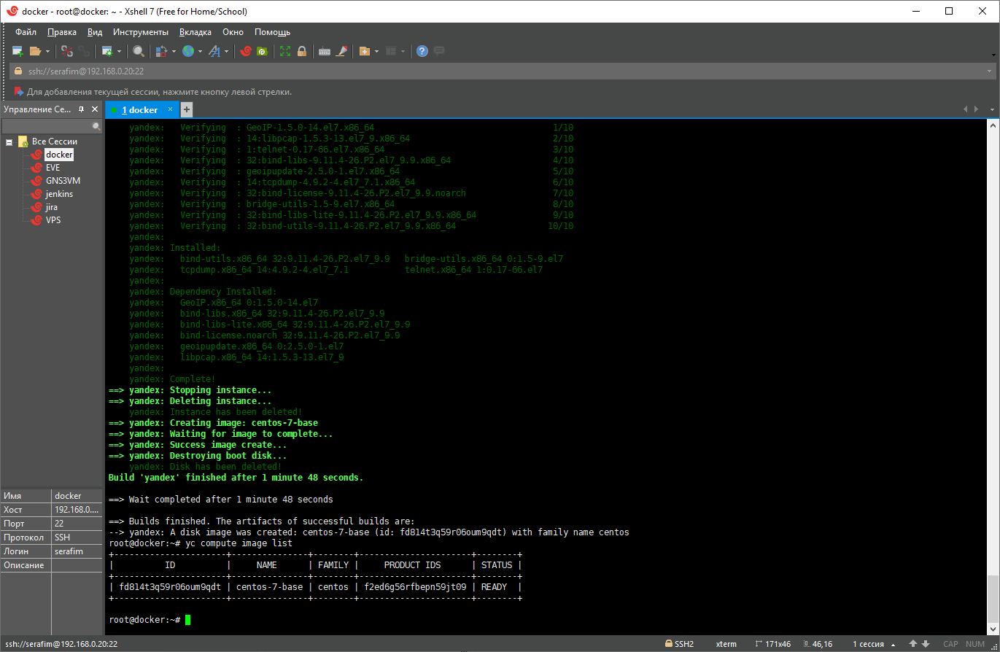
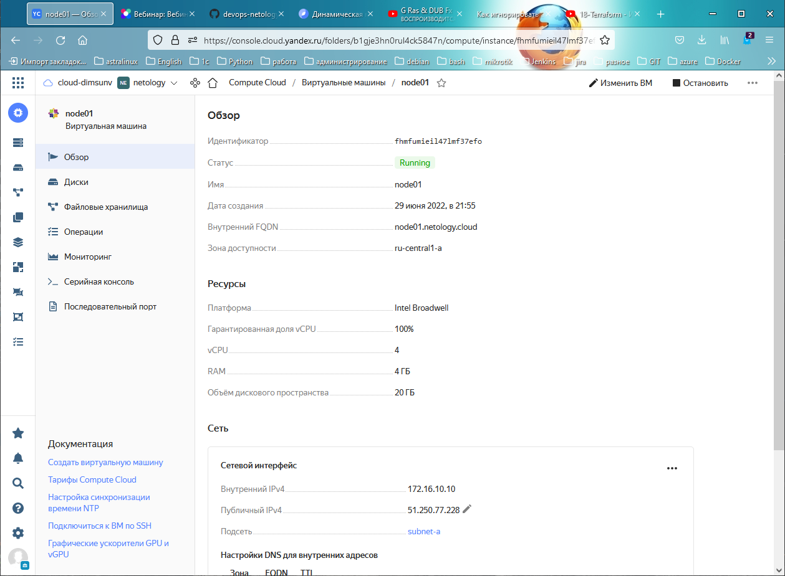
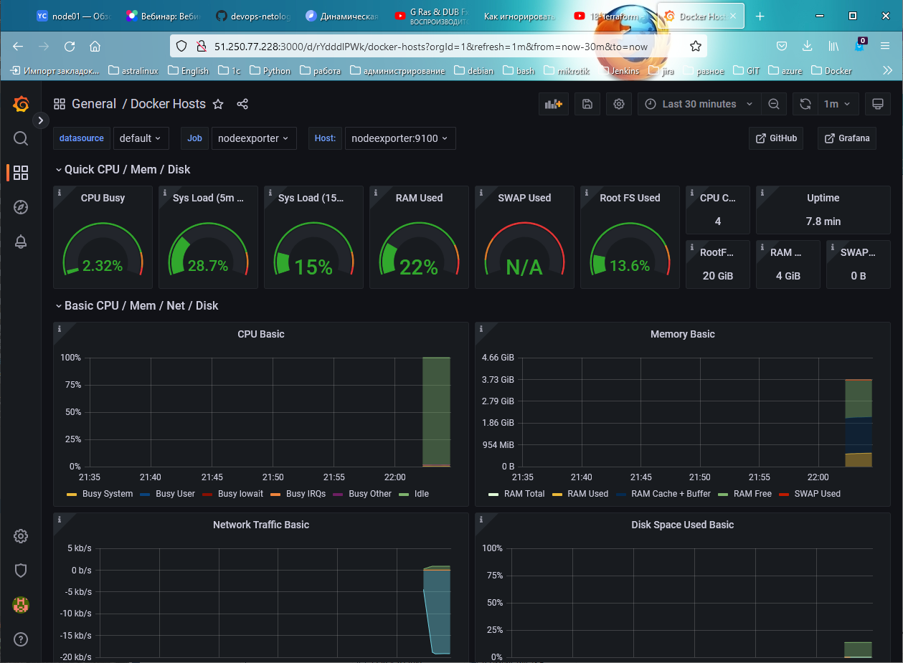
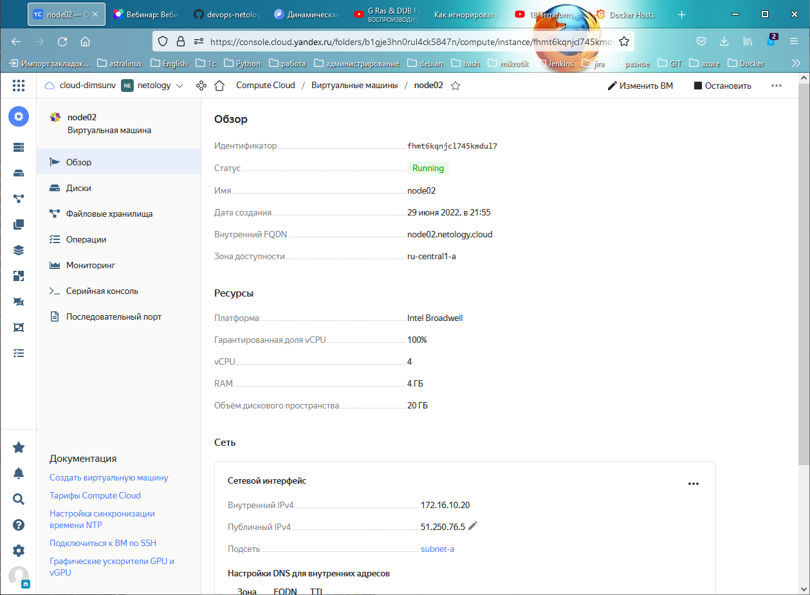
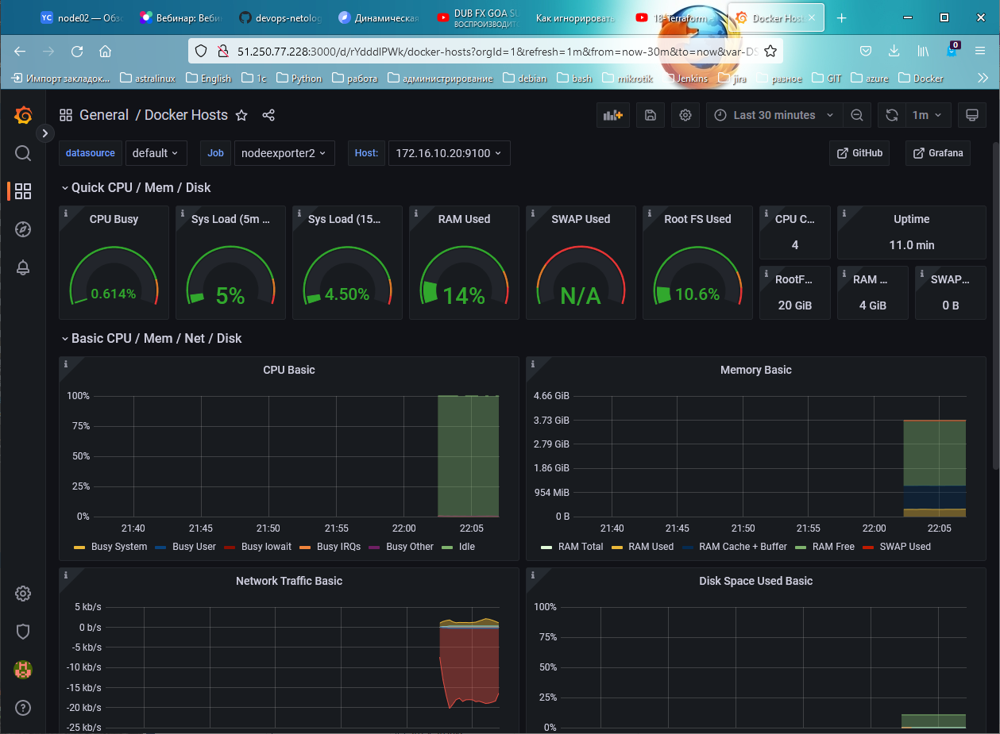

# Домашнее задание к занятию "5.4. Оркестрация группой Docker контейнеров на примере Docker Compose"
## Задача 1
Создать собственный образ операционной системы с помощью Packer.
* Centos Packer: 
## Задача 2
Создать вашу первую виртуальную машину в Яндекс.Облаке.
* Yandex Cloud VM: 
## Задача 3
Создать ваш первый готовый к боевой эксплуатации компонент мониторинга, состоящий из стека микросервисов.
* GRAFANA: 
## Задача 4 (*)

Создать вторую ВМ и подключить её к мониторингу развёрнутому на первом сервере.
* Yandex Cloud VM: 
* GRAFANA: 

* исходники [ТУТ](https://github.com/dimsunv/devops-netology/tree/05-src)
