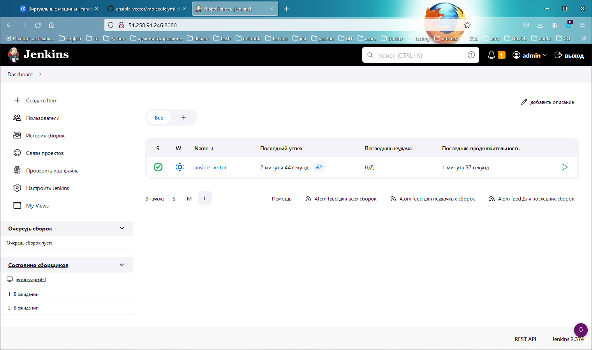
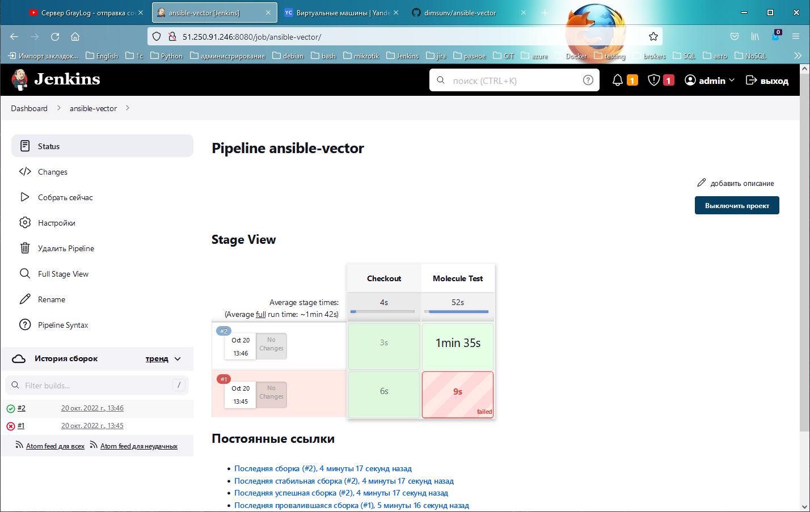
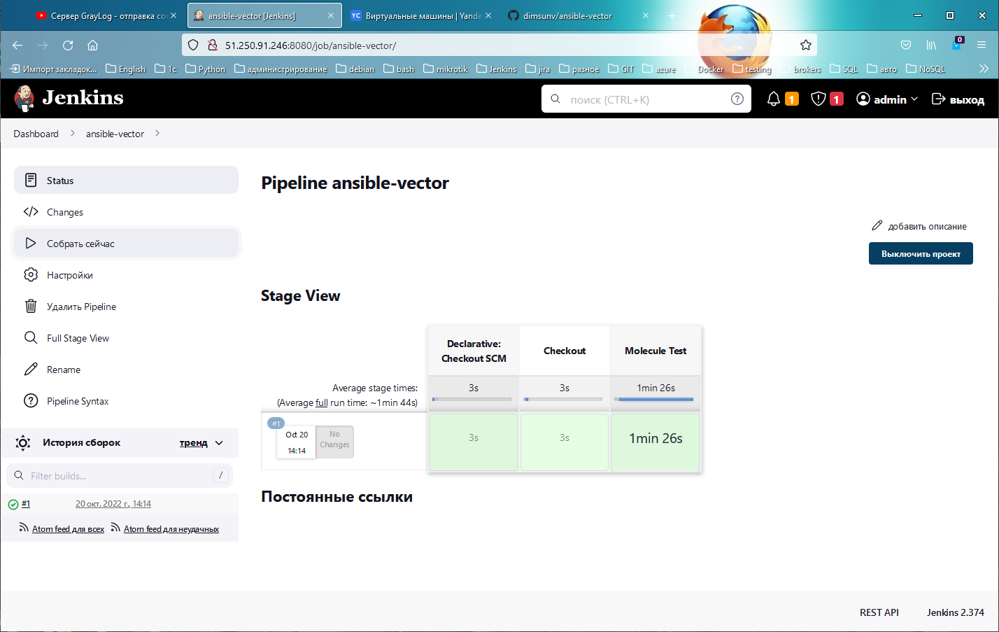
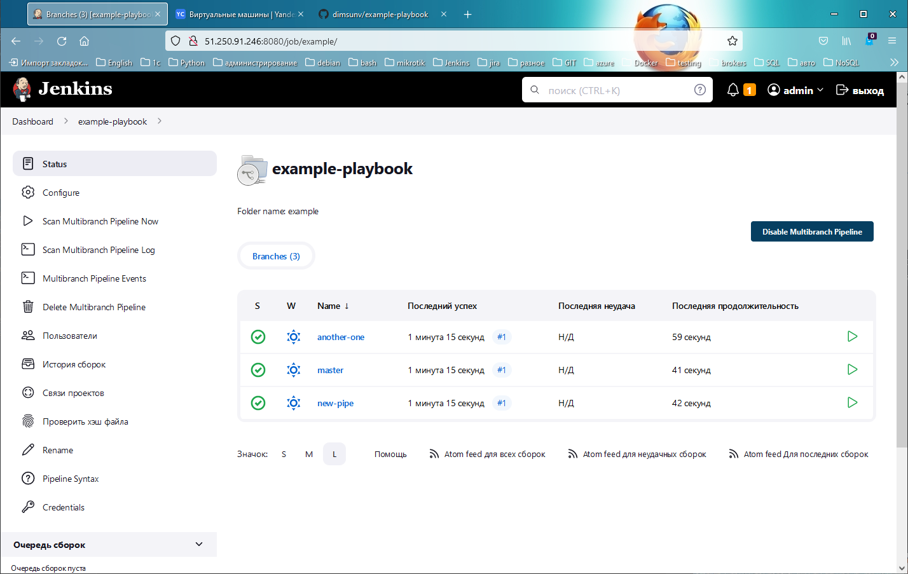
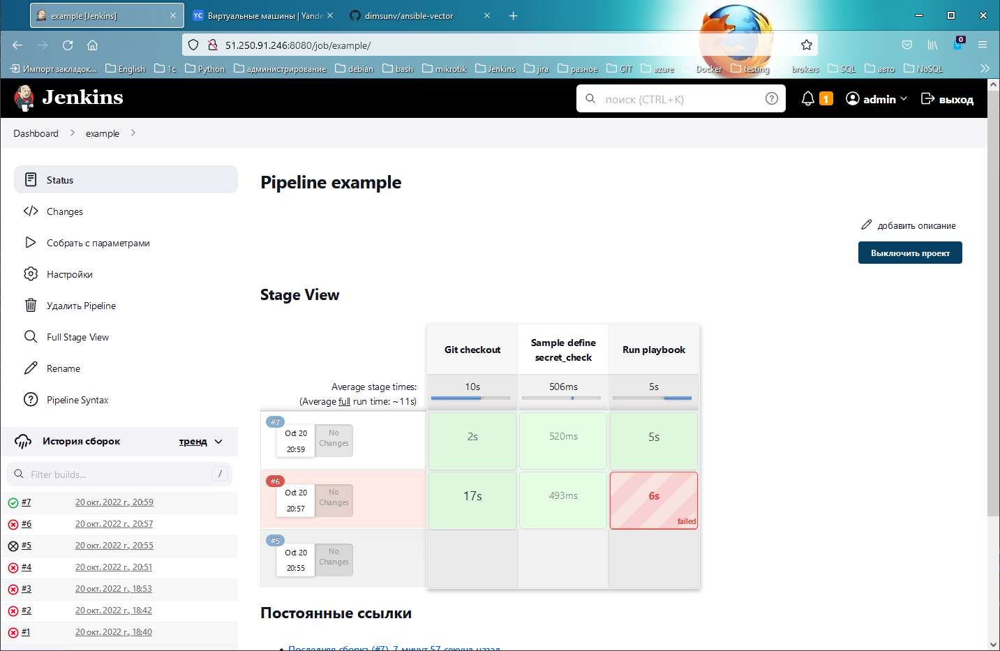

# Домашнее задание к занятию "09.04 Jenkins"

## Подготовка к выполнению

1. Создать 2 VM: для jenkins-master и jenkins-agent.
2. Установить jenkins при помощи playbook'a.
3. Запустить и проверить работоспособность.
4. Сделать первоначальную настройку.

## Основная часть

1. Сделать Freestyle Job, который будет запускать `molecule test` из любого вашего репозитория с ролью.
    
2. Сделать Declarative Pipeline Job, который будет запускать `molecule test` из любого вашего репозитория с ролью.
    ```
    pipeline {
        agent {
            label 'homework'
        }
    
        stages {
            stage('Checkout') {
                steps {
                    git credentialsId: '708a2ed9-77fb-4669-8244-4a414b5bb9f5', url: 'git@github.com:dimsunv/ansible-vector.git'
                }
            }
            stage('Molecule Test'){
                steps {
                    sh 'molecule test -s podman --destroy always'
                }
            }
        }
    }
    ```
   
3. Перенести Declarative Pipeline в репозиторий в файл `Jenkinsfile`.
   
4. Создать Multibranch Pipeline на запуск `Jenkinsfile` из репозитория.
   
5. Создать Scripted Pipeline, наполнить его скриптом из [pipeline](./pipeline).
6. Внести необходимые изменения, чтобы Pipeline запускал `ansible-playbook` без флагов `--check --diff`, если не установлен параметр при запуске джобы (prod_run = True), по умолчанию параметр имеет значение False и запускает прогон с флагами `--check --diff`.
    ```
    node("jenkins-agent-1"){
        stage("Git checkout"){
            git branch: 'new-pipe', credentialsId: '708a2ed9-77fb-4669-8244-4a414b5bb9f5', url: 'git@github.com:dimsunv/example-playbook.git'
        }
        stage("Sample define secret_check"){
            secret_check=true
        }
        stage("Run playbook"){
            if (secret_check){
                if (env.PROD_RUN == true){
                    sh 'ansible-playbook -i inventory/prod.yml site.yml'
                }
                else{
                    sh 'ansible-playbook -i inventory/prod.yml site.yml --check --diff'
                }
            }
            else{
                echo 'need more action'
            }
            
        }
    }
    ```
7. Проверить работоспособность, исправить ошибки, исправленный Pipeline вложить в репозиторий в файл `ScriptedJenkinsfile`.
    [ScriptedJenkinsfile](https://github.com/dimsunv/ansible-vector/blob/master/ScriptedJenkinsfile)
8. Отправить ссылку на репозиторий с ролью и Declarative Pipeline и Scripted Pipeline.
    * [ansible-vector](https://github.com/dimsunv/ansible-vector.git)
    
   
    