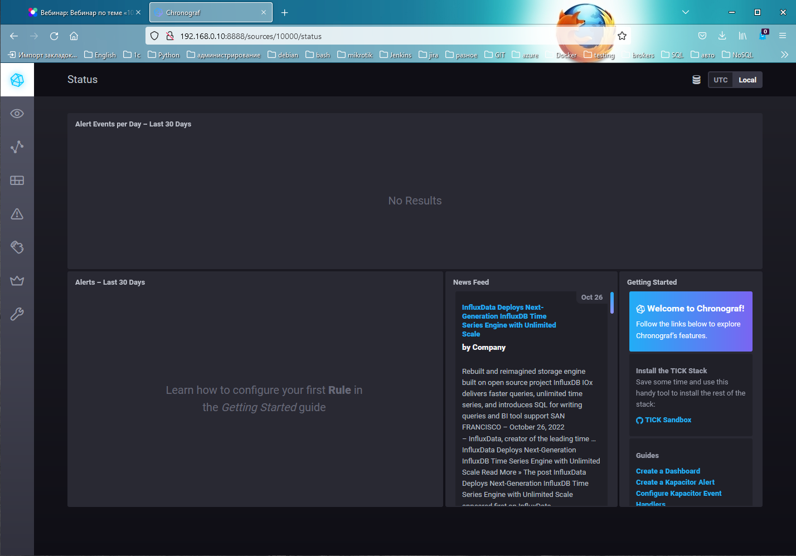
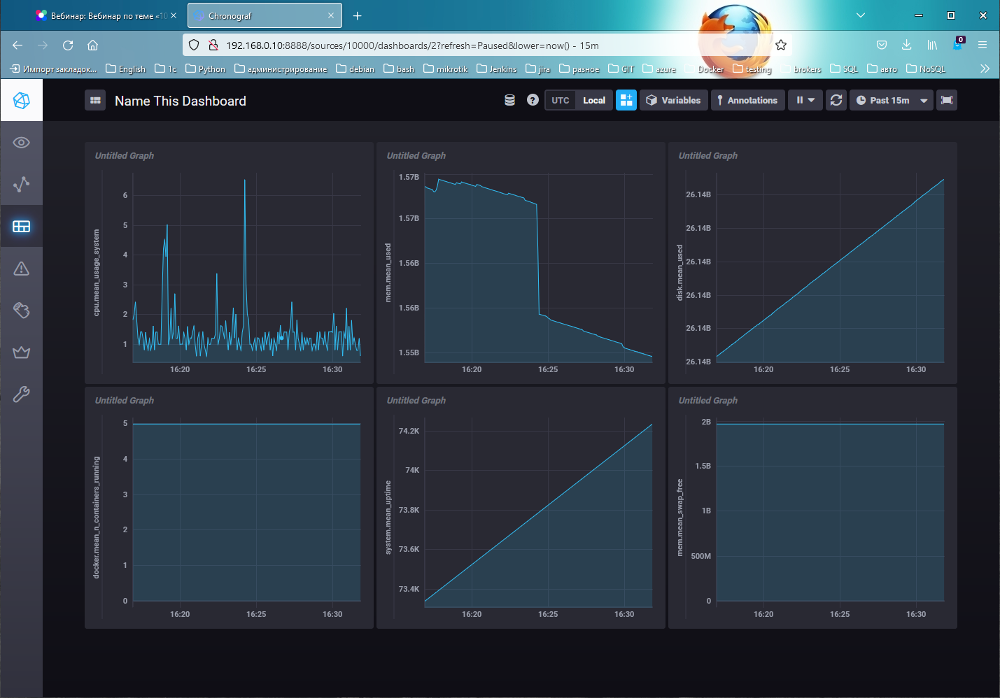

# Домашнее задание к занятию "10.02. Системы мониторинга"

## Обязательные задания

1. Опишите основные плюсы и минусы pull и push систем мониторинга.

2. Какие из ниже перечисленных систем относятся к push модели, а какие к pull? А может есть гибридные?

    - Prometheus - скорее pull, но может с отдельными компонентами работать как push
    - TICK - push
    - Zabbix - гибридная, есть как pull, так активный push агент.
    - VictoriaMetrics - push
    - Nagios - pull

3. Склонируйте себе [репозиторий](https://github.com/influxdata/sandbox/tree/master) и запустите TICK-стэк, 
используя технологии docker и docker-compose.

В виде решения на это упражнение приведите выводы команд с вашего компьютера (виртуальной машины):

 - curl -v http://localhost:8086/ping
    ```
    *   Trying 127.0.0.1:8086...
    * Connected to localhost (127.0.0.1) port 8086 (#0)
    > GET /ping HTTP/1.1
    > Host: localhost:8086
    > User-Agent: curl/7.81.0
    > Accept: */*
    > 
    * Mark bundle as not supporting multiuse
    < HTTP/1.1 204 No Content
    < Content-Type: application/json
    < Request-Id: c884d441-5854-11ed-8814-0242ac160003
    < X-Influxdb-Build: OSS
    < X-Influxdb-Version: 1.8.10
    < X-Request-Id: c884d441-5854-11ed-8814-0242ac160003
    < Date: Sun, 30 Oct 2022 13:14:28 GMT
    < 
    * Connection #0 to host localhost left intact
    ```
 - curl http://localhost:8888
    ```
    <!DOCTYPE html>
    <html>
    <head>
    <link rel="stylesheet" href="/index.c708214f.css"><meta http-equiv="Content-type" content="text/html; charset=utf-8">
    <title>Chronograf</title>
    <link rel="icon shortcut" href="/favicon.70d63073.ico">
    </head>
    <body> 
        <div id="react-root" data-basepath="">
        </div> 
        <script type="module" src="/index.e81b88ee.js">
        </script>
        <script src="/index.a6955a67.js" nomodule="" defer>
        </script> 
    </body>
    </html>
    ```
- curl -v http://localhost:9092/kapacitor/v1/ping   
    ```
    *   Trying 127.0.0.1:9092...
    * Connected to localhost (127.0.0.1) port 9092 (#0)
    > GET /kapacitor/v1/ping HTTP/1.1
    > Host: localhost:9092
    > User-Agent: curl/7.81.0
    > Accept: */*
    > 
    * Mark bundle as not supporting multiuse
    < HTTP/1.1 204 No Content
    < Content-Type: application/json; charset=utf-8
    < Request-Id: 68d8ef05-5855-11ed-87cc-0242ac160004
    < X-Kapacitor-Version: 1.6.5
    < Date: Sun, 30 Oct 2022 13:18:57 GMT
    < 
    * Connection #0 to host localhost left intact
    ```
* А также скриншот веб-интерфейса ПО chronograf (`http://localhost:8888`). 


P.S.: если при запуске некоторые контейнеры будут падать с ошибкой - проставьте им режим `Z`, например
`./data:/var/lib:Z`

4. Перейдите в веб-интерфейс Chronograf (`http://localhost:8888`) и откройте вкладку `Data explorer`.

    - Нажмите на кнопку `Add a query`
    - Изучите вывод интерфейса и выберите БД `telegraf.autogen`
    - В `measurments` выберите mem->host->telegraf_container_id , а в `fields` выберите used_percent. 
    Внизу появится график утилизации оперативной памяти в контейнере telegraf.
    - Вверху вы можете увидеть запрос, аналогичный SQL-синтаксису. 
    Поэкспериментируйте с запросом, попробуйте изменить группировку и интервал наблюдений.

Для выполнения задания приведите скриншот с отображением метрик утилизации места на диске 
(disk->host->telegraf_container_id) из веб-интерфейса.

5. Изучите список [telegraf inputs](https://github.com/influxdata/telegraf/tree/master/plugins/inputs). 
Добавьте в конфигурацию telegraf следующий плагин - [docker](https://github.com/influxdata/telegraf/tree/master/plugins/inputs/docker):
```
[[inputs.docker]]
  endpoint = "unix:///var/run/docker.sock"
```

Дополнительно вам может потребоваться донастройка контейнера telegraf в `docker-compose.yml` дополнительного volume и 
режима privileged:
```
  telegraf:
    image: telegraf:1.4.0
    privileged: true
    volumes:
      - ./etc/telegraf.conf:/etc/telegraf/telegraf.conf:Z
      - /var/run/docker.sock:/var/run/docker.sock:Z
    links:
      - influxdb
    ports:
      - "8092:8092/udp"
      - "8094:8094"
      - "8125:8125/udp"
```

После настройке перезапустите telegraf, обновите веб интерфейс и приведите скриншотом список `measurments` в 
веб-интерфейсе базы telegraf.autogen . Там должны появиться метрики, связанные с docker.

Факультативно можете изучить какие метрики собирает telegraf после выполнения данного задания.

## Дополнительное задание (со звездочкой*) - необязательно к выполнению

В веб-интерфейсе откройте вкладку `Dashboards`. Попробуйте создать свой dashboard с отображением:

    - утилизации ЦПУ
    - количества использованного RAM
    - утилизации пространства на дисках
    - количество поднятых контейнеров
    - аптайм
    - ...
    - фантазируйте)
    
