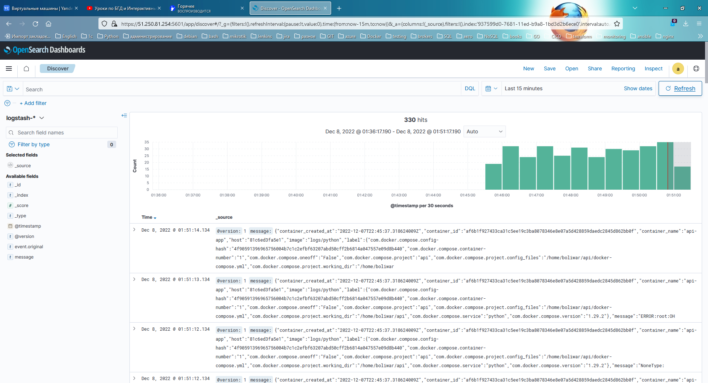

# Домашнее задание к занятию "10.04. ELK"

<details>
<summary>Дополнительные ссылки</summary>
При выполнении задания пользуйтесь вспомогательными ресурсами:

- [поднимаем elk в докер](https://www.elastic.co/guide/en/elastic-stack-get-started/current/get-started-docker.html)
- [поднимаем elk в докер с filebeat и докер логами](https://www.sarulabs.com/post/5/2019-08-12/sending-docker-logs-to-elasticsearch-and-kibana-with-filebeat.html)
- [конфигурируем logstash](https://www.elastic.co/guide/en/logstash/current/configuration.html)
- [плагины filter для logstash](https://www.elastic.co/guide/en/logstash/current/filter-plugins.html)
- [конфигурируем filebeat](https://www.elastic.co/guide/en/beats/libbeat/5.3/config-file-format.html)
- [привязываем индексы из elastic в kibana](https://www.elastic.co/guide/en/kibana/current/index-patterns.html)
- [как просматривать логи в kibana](https://www.elastic.co/guide/en/kibana/current/discover.html)
- [решение ошибки increase vm.max_map_count elasticsearch](https://stackoverflow.com/questions/42889241/how-to-increase-vm-max-map-count)

В процессе выполнения задания могут возникнуть также не указанные тут проблемы в зависимости от системы.

Используйте output stdout filebeat/kibana и api elasticsearch для изучения корня проблемы и ее устранения.
</details>

## Задание повышенной сложности

Не используйте директорию [help](./help) при выполнении домашнего задания.

## Задание 1

Вам необходимо поднять в докере:
- elasticsearch(hot и warm ноды)
- logstash
- kibana
- filebeat

и связать их между собой.

Logstash следует сконфигурировать для приёма по tcp json сообщений.

Filebeat следует сконфигурировать для отправки логов docker вашей системы в logstash.

В директории [help](./help) находится манифест docker-compose и конфигурации filebeat/logstash для быстрого
выполнения данного задания.

Результатом выполнения данного задания должны быть:
- скриншот `docker ps` через 5 минут после старта всех контейнеров (их должно быть 5)
- скриншот интерфейса kibana
- docker-compose манифест (если вы не использовали директорию help)
- ваши yml конфигурации для стека (если вы не использовали директорию help)

***task solution***


<details>
<summary>opensearch cluster docker ps</summary>
```
boliwar@opensearch-cluster:~$ docker ps
CONTAINER ID   IMAGE                                                                COMMAND                  CREATED         STATUS         PORTS                                                                                                      NAMES
eb5e0233b42f   opensearchproject/opensearch-dashboards:2.4.0                        "./opensearch-dashbo…"   4 minutes ago   Up 4 minutes   0.0.0.0:5601->5601/tcp, :::5601->5601/tcp                                                                  opensearch_kibana_1
fe39fa68f6ed   opensearchproject/opensearch:2.4.0                                   "./opensearch-docker…"   4 minutes ago   Up 4 minutes   9200/tcp, 9300/tcp, 9600/tcp, 9650/tcp                                                                     opensearch_os02_1
3643124ceb85   opensearchproject/opensearch:2.4.0                                   "./opensearch-docker…"   4 minutes ago   Up 4 minutes   0.0.0.0:9200->9200/tcp, :::9200->9200/tcp, 9300/tcp, 0.0.0.0:9600->9600/tcp, :::9600->9600/tcp, 9650/tcp   opensearch_os00_1
8a79f8f35fbb   opensearchproject/opensearch:2.4.0                                   "./opensearch-docker…"   4 minutes ago   Up 4 minutes   9200/tcp, 9300/tcp, 9600/tcp, 9650/tcp                                                                     opensearch_os03_1
426a6d0d3717   opensearchproject/opensearch:2.4.0                                   "./opensearch-docker…"   4 minutes ago   Up 4 minutes   9200/tcp, 9300/tcp, 9600/tcp, 9650/tcp                                                                     opensearch_os01_1
cd09839711ea   opensearchproject/logstash-oss-with-opensearch-output-plugin:8.4.0   "/usr/local/bin/dock…"   4 minutes ago   Up 4 minutes   5044/tcp, 0.0.0.0:5000->5000/tcp, :::5000->5000/tcp, 9600/tcp                                              opensearch_logstash_1

```
</details>



<details>
<summary>opensearch cluster docker-compose.yml</summary>
```
version: '3.7'

services:
  os00:
    restart: always
    image: opensearchproject/opensearch:2.4.0
    environment:
      OPENSEARCH_JAVA_OPTS: "-Xms1024m -Xmx1024m"
      node.name: os00
      node.roles: ''
      discovery.seed_hosts: os00,os01,os02,os03
      cluster.initial_master_nodes: os01
      plugins.security.ssl.transport.pemkey_filepath: certificates/os00/os00.key # relative path
      plugins.security.ssl.transport.pemcert_filepath: certificates/os00/os00.pem
      plugins.security.ssl.http.pemkey_filepath: certificates/os00/os00.key
      plugins.security.ssl.http.pemcert_filepath: certificates/os00/os00.pem
      DISABLE_INSTALL_DEMO_CONFIG: "true"
      JAVA_HOME: /usr/share/opensearch/jdk
      bootstrap.memory_lock: "true"
      network.host: "0.0.0.0"
    ulimits:
      memlock:
        soft: -1
        hard: -1
    volumes:
      - "./opensearch.yml:/usr/share/opensearch/config/opensearch.yml"
      - "./internal_users.yml:/usr/share/opensearch/config/opensearch-security/internal_users.yml"
      - "os-data0:/usr/share/opensearch/data"
      - "./certs:/usr/share/opensearch/config/certificates:ro"
    ports:
      - 9200:9200
      - 9600:9600
    networks:
      - os-test

  os01:
    restart: always
    image: opensearchproject/opensearch:2.4.0
    environment:
      OPENSEARCH_JAVA_OPTS: "-Xms512m -Xmx512m"
      node.name: os01
      node.roles: 'master'
      discovery.seed_hosts: os00,os01,os02,os03
      cluster.initial_master_nodes: os01
      plugins.security.ssl.transport.pemkey_filepath: certificates/os01/os01.key # relative path
      plugins.security.ssl.transport.pemcert_filepath: certificates/os01/os01.pem
      plugins.security.ssl.http.pemkey_filepath: certificates/os01/os01.key
      plugins.security.ssl.http.pemcert_filepath: certificates/os01/os01.pem
      DISABLE_INSTALL_DEMO_CONFIG: "true"
      JAVA_HOME: /usr/share/opensearch/jdk
      bootstrap.memory_lock: "true"
      network.host: "0.0.0.0"
    ulimits:
      memlock:
        soft: -1
        hard: -1
    volumes:
      - "./opensearch.yml:/usr/share/opensearch/config/opensearch.yml"
      - "./internal_users.yml:/usr/share/opensearch/config/opensearch-security/internal_users.yml"
      - "os-data1:/usr/share/opensearch/data"
      - "./certs:/usr/share/opensearch/config/certificates:ro"
    networks:
      - os-test

  os02:
    restart: always
    image: opensearchproject/opensearch:2.4.0
    environment:
      OPENSEARCH_JAVA_OPTS: "-Xms1024m -Xmx1024m"
      node.name: os02
      node.roles: 'ingest, data'
      node.attr.temp: hot
      discovery.seed_hosts: os00,os01,os02,os03
      cluster.initial_master_nodes: os01
      plugins.security.ssl.transport.pemkey_filepath: certificates/os02/os02.key # relative path
      plugins.security.ssl.transport.pemcert_filepath: certificates/os02/os02.pem
      plugins.security.ssl.http.pemkey_filepath: certificates/os02/os02.key
      plugins.security.ssl.http.pemcert_filepath: certificates/os02/os02.pem
      DISABLE_INSTALL_DEMO_CONFIG: "true"
      JAVA_HOME: /usr/share/opensearch/jdk
      bootstrap.memory_lock: "true"
      network.host: "0.0.0.0"
    ulimits:
      memlock:
        soft: -1
        hard: -1
    volumes:
      - "./opensearch.yml:/usr/share/opensearch/config/opensearch.yml"
      - "./internal_users.yml:/usr/share/opensearch/config/opensearch-security/internal_users.yml"
      - "os-data2:/usr/share/opensearch/data"
      - "./certs:/usr/share/opensearch/config/certificates:ro"
    networks:
      - os-test

  os03:
    restart: always
    image: opensearchproject/opensearch:2.4.0
    environment:
      OPENSEARCH_JAVA_OPTS: "-Xms1024m -Xmx1024m"
      node.name: os03
      node.roles: 'data'
      node.attr.temp: warm
      discovery.seed_hosts: os00,os01,os02,os03
      cluster.initial_master_nodes: os01
      plugins.security.ssl.transport.pemkey_filepath: certificates/os03/os03.key # relative path
      plugins.security.ssl.transport.pemcert_filepath: certificates/os03/os03.pem
      plugins.security.ssl.http.pemkey_filepath: certificates/os03/os03.key
      plugins.security.ssl.http.pemcert_filepath: certificates/os03/os03.pem
      DISABLE_INSTALL_DEMO_CONFIG: "true"
      JAVA_HOME: /usr/share/opensearch/jdk
      bootstrap.memory_lock: "true"
      network.host: "0.0.0.0"
    ulimits:
      memlock:
        soft: -1
        hard: -1
    volumes:
      - "./opensearch.yml:/usr/share/opensearch/config/opensearch.yml"
      - "./internal_users.yml:/usr/share/opensearch/config/opensearch-security/internal_users.yml"
      - "os-data3:/usr/share/opensearch/data"
      - "./certs:/usr/share/opensearch/config/certificates:ro"
    networks:
      - os-test

  kibana:
    restart: always
    image: opensearchproject/opensearch-dashboards:2.4.0
    volumes:
      - "./certs:/usr/share/opensearch-dashboards/config/certificates:ro"
      - "./opensearch-dashboards.yml:/usr/share/opensearch-dashboards/config/opensearch_dashboards.yml"
    ports:
      - 5601:5601
    environment:
      OPENSEARCH_HOSTS: '["https://os00:9200","https://os01:9200","https://os02:9200","https://os03:9200"]'
      DISABLE_INSTALL_DEMO_CONFIG: "true"
    networks:
      - os-test

  logstash:
    restart: always
    image: opensearchproject/logstash-oss-with-opensearch-output-plugin:8.4.0
    ports:
      - 5000:5000
    volumes:
      - "./logstash.yml:/usr/share/logstash/config/logstash.yml"
      - "./logstash.conf:/usr/share/logstash/pipeline/logstash.conf"
      - "./certs:/usr/share/logstash/config/certificates:ro"
    environment:
      DISABLE_INSTALL_DEMO_CONFIG: "true"
      OPENSEARCH_HOSTS: '["https://os01:9200"]'
    networks:
      - os-test

volumes:
  os-data0:
  os-data1:
  os-data2:
  os-data3:

networks:
  os-test:
   driver: bridge

```
</details>

<details>
<summary>vector docker-compose.yml</summary>
```
version: '3.7'

services:
  vector:
    image: timberio/vector:0.25.2-debian
    volumes:
      - "./vector/vector.yml:/etc/vector/vector.yml"
      - "/var/run:/var/run"
    command: " --config-yaml /etc/vector/vector.yml --watch-config"
    networks:
      - net
  python:
    image: logs/python
    build: ./python
    container_name: api-app
    networks:
      - net

networks:
  net:
    driver: bridge
```
</details>

<details>
<summary>opensearch.yml</summary>
```
---
cluster.name: os-cluster
network.host: 0.0.0.0

bootstrap.memory_lock: "true" # along with the memlock settings below, disables swapping

cluster.routing.allocation.disk.threshold_enabled: true
cluster.routing.allocation.disk.watermark.low: 93%
cluster.routing.allocation.disk.watermark.high: 95%

plugins.security.allow_unsafe_democertificates: true
plugins.security.ssl.http.enabled: true
plugins.security.ssl.http.pemtrustedcas_filepath: certificates/ca/ca.pem
plugins.security.ssl.transport.enabled: true
plugins.security.ssl.transport.pemtrustedcas_filepath: certificates/ca/ca.pem
plugins.security.ssl.transport.enforce_hostname_verification: false

plugins.security.authcz.admin_dn:
  - 'CN=ADMIN,O=NETOLOGY,L=SPB,ST=SPB,C=RU'
plugins.security.nodes_dn:
  - 'CN=os00,O=NETOLOGY,L=SPB,ST=SPB,C=RU'
  - 'CN=os01,O=NETOLOGY,L=SPB,ST=SPB,C=RU'
  - 'CN=os02,O=NETOLOGY,L=SPB,ST=SPB,C=RU'
  - 'CN=os03,O=NETOLOGY,L=SPB,ST=SPB,C=RU'
```
</details>

<details>
<summary>opensearch-dashboard.yml</summary>
```
---
server.name: os_dashboards
server.host: "0.0.0.0"

opensearch.username: "admin"
opensearch.password: "admin"

# Encrypt traffic between the browser and OpenSearch-Dashboards
server.ssl.enabled: true
server.ssl.certificate: "/usr/share/opensearch-dashboards/config/certificates/os-dashboards/os-dashboards.pem"
server.ssl.key: "/usr/share/opensearch-dashboards/config/certificates/os-dashboards/os-dashboards.key"

# Encrypt traffic between OpenSearch-Dashboards and Opensearch
opensearch.ssl.certificateAuthorities: ["/usr/share/opensearch-dashboards/config/certificates/ca/ca.pem"]
opensearch.ssl.verificationMode: full
```
</details>

<details>
<summary>logstash.yml</summary>
```
input {
  tcp {
    mode => "server"
    port => 5000
    codec => "line"
  }
}

output {
  opensearch {
    hosts => ["https://os01:9200"]
    index => "logstash-%{+YYYY.MM.dd}"
    user => "logstash"
    password => "logstash"
    ssl => "true"
    ssl_certificate_verification => "true"
    cacert => "/usr/share/logstash/config/certificates/ca/ca.pem"
  }
}
```
</details>

## Задание 2

Перейдите в меню [создания index-patterns  в kibana](http://localhost:5601/app/management/kibana/indexPatterns/create)
и создайте несколько index-patterns из имеющихся.

Перейдите в меню просмотра логов в kibana (Discover) и самостоятельно изучите как отображаются логи и как производить
поиск по логам.

В манифесте директории help также приведенно dummy приложение, которое генерирует рандомные события в stdout контейнера.
Данные логи должны порождать индекс logstash-* в elasticsearch. Если данного индекса нет - воспользуйтесь советами
и источниками из раздела "Дополнительные ссылки" данного ДЗ.

---
***task solution***


[repository](https://github.com/dimsunv/devops-netology/tree/10-monitoring-04-elk)
