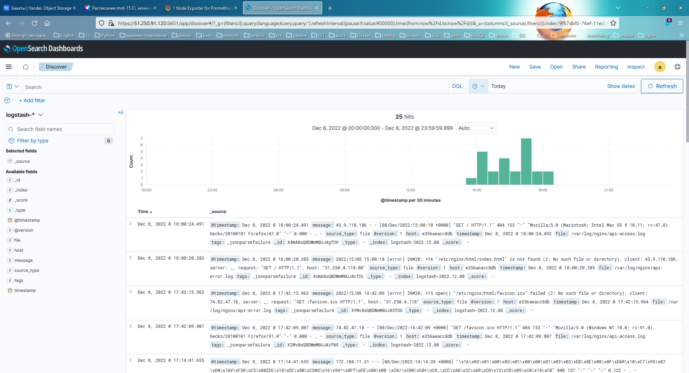
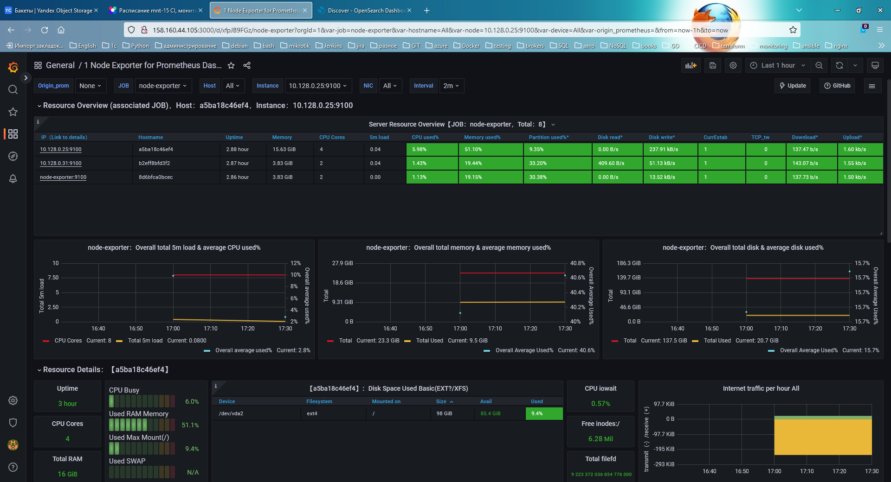

# Домашнее задание к занятию "11.03 Микросервисы: подходы"

Вы работаете в крупной компанию, которая строит систему на основе микросервисной архитектуры.
Вам как DevOps специалисту необходимо выдвинуть предложение по организации инфраструктуры, для разработки и эксплуатации.


## Задача 1: Обеспечить разработку

Предложите решение для обеспечения процесса разработки: хранение исходного кода, непрерывная интеграция и непрерывная поставка.
Решение может состоять из одного или нескольких программных продуктов и должно описывать способы и принципы их взаимодействия.

Решение должно соответствовать следующим требованиям:
- Облачная система;
- Система контроля версий Git;
- Репозиторий на каждый сервис;
- Запуск сборки по событию из системы контроля версий;
- Запуск сборки по кнопке с указанием параметров;
- Возможность привязать настройки к каждой сборке;
- Возможность создания шаблонов для различных конфигураций сборок;
- Возможность безопасного хранения секретных данных: пароли, ключи доступа;
- Несколько конфигураций для сборки из одного репозитория;
- Кастомные шаги при сборке;
- Собственные докер образы для сборки проектов;
- Возможность развернуть агентов сборки на собственных серверах;
- Возможность параллельного запуска нескольких сборок;
- Возможность параллельного запуска тестов;

Обоснуйте свой выбор.

***task solution***

- YandexCloud, Asure, AWS имеют весь набор популярных инструментов:
  * Gitlab для CI/CD
  * Container Registry для хранения образов
  * Object Storage для хранения артефактов и сборок

## Задача 2: Логи

Предложите решение для обеспечения сбора и анализа логов сервисов в микросервисной архитектуре.
Решение может состоять из одного или нескольких программных продуктов и должно описывать способы и принципы их взаимодействия.

Решение должно соответствовать следующим требованиям:
- Сбор логов в центральное хранилище со всех хостов обслуживающих систему;
- Минимальные требования к приложениям, сбор логов из stdout;
- Гарантированная доставка логов до центрального хранилища;
- Обеспечение поиска и фильтрации по записям логов;
- Обеспечение пользовательского интерфейса с возможностью предоставления доступа разработчикам для поиска по записям логов;
- Возможность дать ссылку на сохраненный поиск по записям логов;

Обоснуйте свой выбор.

***task solution***

- Самый популярны и самый требовательный к ресурсам это конечно стэк ELK (`Elasticsearch`, `Logstash`, `Kibana`) либо его opensource fork `Opensearch`, `Opensearch Output Plugin`, `Opensearch Dashboard`
- Набирающий популярность `Grafana Loki` + `Promtail`  или `Vector`

## Задача 3: Мониторинг

Предложите решение для обеспечения сбора и анализа состояния хостов и сервисов в микросервисной архитектуре.
Решение может состоять из одного или нескольких программных продуктов и должно описывать способы и принципы их взаимодействия.

Решение должно соответствовать следующим требованиям:
- Сбор метрик со всех хостов, обслуживающих систему;
- Сбор метрик состояния ресурсов хостов: CPU, RAM, HDD, Network;
- Сбор метрик потребляемых ресурсов для каждого сервиса: CPU, RAM, HDD, Network;
- Сбор метрик, специфичных для каждого сервиса;
- Пользовательский интерфейс с возможностью делать запросы и агрегировать информацию;
- Пользовательский интерфейс с возможность настраивать различные панели для отслеживания состояния системы;

Обоснуйте свой выбор.

- Самый популярный и безотказный вариант:
  * `prometheus` для хранения метрик
  * `node-exporter` для сбора метрик, `kubernetes` поддерживает выдачу метрик в формате `prometheus`
  * `cadvisor` для сбора метрик с контейнеров
  * `alert-manager` для обнаружения алертов, можно в качестве замены использовать `zabbix`
  * `grafana` для отображения и оповещения
  *

## Задача 4: Логи * (необязательная)

Продолжить работу по задаче API Gateway: сервисы используемые в задаче пишут логи в stdout.

Добавить в систему сервисы для сбора логов Vector + ElasticSearch + Kibana со всех сервисов обеспечивающих работу API.

### Результат выполнения:

docker compose файл запустив который можно перейти по адресу http://localhost:8081 по которому доступна Kibana.
Логин в Kibana должен быть admin пароль qwerty123456

<details>
<summary>Opensearch docker-compose.yml</summary>



```
version: '3.7'

services:
  os00:
    restart: always
    image: opensearchproject/opensearch:2.4.0
    environment:
      OPENSEARCH_JAVA_OPTS: "-Xms1024m -Xmx1024m"
      node.name: os00
      node.roles: ''
      discovery.seed_hosts: os00,os01,os02,os03
      cluster.initial_master_nodes: os01
      plugins.security.ssl.transport.pemkey_filepath: certificates/os00/os00.key # relative path
      plugins.security.ssl.transport.pemcert_filepath: certificates/os00/os00.pem
      plugins.security.ssl.http.pemkey_filepath: certificates/os00/os00.key
      plugins.security.ssl.http.pemcert_filepath: certificates/os00/os00.pem
      DISABLE_INSTALL_DEMO_CONFIG: "true"
      JAVA_HOME: /usr/share/opensearch/jdk
      bootstrap.memory_lock: "true"
      network.host: "0.0.0.0"
    ulimits:
      memlock:
        soft: -1
        hard: -1
    volumes:
      - "./opensearch.yml:/usr/share/opensearch/config/opensearch.yml"
      - "./internal_users.yml:/usr/share/opensearch/config/opensearch-security/internal_users.yml"
      - "os-data0:/usr/share/opensearch/data"
      - "./certs:/usr/share/opensearch/config/certificates:ro"
    ports:
      - 9200:9200
      - 9600:9600
    networks:
      - os-test

  os01:
    restart: always
    image: opensearchproject/opensearch:2.4.0
    environment:
      OPENSEARCH_JAVA_OPTS: "-Xms512m -Xmx512m"
      node.name: os01
      node.roles: 'master'
      discovery.seed_hosts: os00,os01,os02,os03
      cluster.initial_master_nodes: os01
      plugins.security.ssl.transport.pemkey_filepath: certificates/os01/os01.key # relative path
      plugins.security.ssl.transport.pemcert_filepath: certificates/os01/os01.pem
      plugins.security.ssl.http.pemkey_filepath: certificates/os01/os01.key
      plugins.security.ssl.http.pemcert_filepath: certificates/os01/os01.pem
      DISABLE_INSTALL_DEMO_CONFIG: "true"
      JAVA_HOME: /usr/share/opensearch/jdk
      bootstrap.memory_lock: "true"
      network.host: "0.0.0.0"
    ulimits:
      memlock:
        soft: -1
        hard: -1
    volumes:
      - "./opensearch.yml:/usr/share/opensearch/config/opensearch.yml"
      - "./internal_users.yml:/usr/share/opensearch/config/opensearch-security/internal_users.yml"
      - "os-data1:/usr/share/opensearch/data"
      - "./certs:/usr/share/opensearch/config/certificates:ro"
    networks:
      - os-test

  os02:
    restart: always
    image: opensearchproject/opensearch:2.4.0
    environment:
      OPENSEARCH_JAVA_OPTS: "-Xms1024m -Xmx1024m"
      node.name: os02
      node.roles: 'ingest, data'
      node.attr.temp: hot
      discovery.seed_hosts: os00,os01,os02,os03
      cluster.initial_master_nodes: os01
      plugins.security.ssl.transport.pemkey_filepath: certificates/os02/os02.key # relative path
      plugins.security.ssl.transport.pemcert_filepath: certificates/os02/os02.pem
      plugins.security.ssl.http.pemkey_filepath: certificates/os02/os02.key
      plugins.security.ssl.http.pemcert_filepath: certificates/os02/os02.pem
      DISABLE_INSTALL_DEMO_CONFIG: "true"
      JAVA_HOME: /usr/share/opensearch/jdk
      bootstrap.memory_lock: "true"
      network.host: "0.0.0.0"
    ulimits:
      memlock:
        soft: -1
        hard: -1
    volumes:
      - "./opensearch.yml:/usr/share/opensearch/config/opensearch.yml"
      - "./internal_users.yml:/usr/share/opensearch/config/opensearch-security/internal_users.yml"
      - "os-data2:/usr/share/opensearch/data"
      - "./certs:/usr/share/opensearch/config/certificates:ro"
    networks:
      - os-test

  os03:
    restart: always
    image: opensearchproject/opensearch:2.4.0
    environment:
      OPENSEARCH_JAVA_OPTS: "-Xms1024m -Xmx1024m"
      node.name: os03
      node.roles: 'data'
      node.attr.temp: warm
      discovery.seed_hosts: os00,os01,os02,os03
      cluster.initial_master_nodes: os01
      plugins.security.ssl.transport.pemkey_filepath: certificates/os03/os03.key # relative path
      plugins.security.ssl.transport.pemcert_filepath: certificates/os03/os03.pem
      plugins.security.ssl.http.pemkey_filepath: certificates/os03/os03.key
      plugins.security.ssl.http.pemcert_filepath: certificates/os03/os03.pem
      DISABLE_INSTALL_DEMO_CONFIG: "true"
      JAVA_HOME: /usr/share/opensearch/jdk
      bootstrap.memory_lock: "true"
      network.host: "0.0.0.0"
    ulimits:
      memlock:
        soft: -1
        hard: -1
    volumes:
      - "./opensearch.yml:/usr/share/opensearch/config/opensearch.yml"
      - "./internal_users.yml:/usr/share/opensearch/config/opensearch-security/internal_users.yml"
      - "os-data3:/usr/share/opensearch/data"
      - "./certs:/usr/share/opensearch/config/certificates:ro"
    networks:
      - os-test

  kibana:
    restart: always
    image: opensearchproject/opensearch-dashboards:2.4.0
    volumes:
      - "./certs:/usr/share/opensearch-dashboards/config/certificates:ro"
      - "./opensearch-dashboards.yml:/usr/share/opensearch-dashboards/config/opensearch_dashboards.yml"
    ports:
      - 5601:5601
    environment:
      OPENSEARCH_HOSTS: '["https://os00:9200","https://os01:9200","https://os02:9200","https://os03:9200"]'
      DISABLE_INSTALL_DEMO_CONFIG: "true"
    networks:
      - os-test

  logstash:
    restart: always
    image: opensearchproject/logstash-oss-with-opensearch-output-plugin:8.4.0
    ports:
      - 5000:5000
    volumes:
      - "./logstash.yml:/usr/share/logstash/config/logstash.yml"
      - "./logstash.conf:/usr/share/logstash/pipeline/logstash.conf"
      - "./certs:/usr/share/logstash/config/certificates:ro"
    environment:
      DISABLE_INSTALL_DEMO_CONFIG: "true"
      OPENSEARCH_HOSTS: '["https://os01:9200"]'
    networks:
      - os-test

  cadvisor:
    image: gcr.io/cadvisor/cadvisor
    volumes:
      - /:/rootfs:ro
      - /var/run:/var/run:rw
      - /sys:/sys:ro
      - /var/lib/docker/:/var/lib/docker:ro
    ports:
      - 8080:8080
    networks:
      - os-test
    restart: always

  node-exporter:
    image: quay.io/prometheus/node-exporter:latest
    volumes:
      - /proc:/host/proc:ro
      - /sys:/host/sys:ro
      - /:/rootfs:ro
      - /:/host:ro,rslave
    command:
      - '--path.rootfs=/host'
      - '--path.procfs=/host/proc'
      - '--path.sysfs=/host/sys'
      - --collector.filesystem.ignored-mount-points
      - "^/(sys|proc|dev|host|etc|rootfs/var/lib/docker/containers|rootfs/var/lib/docker/overlay2|rootfs/run/docker/netns|rootfs/var/lib/docker/aufs)($$|/)"
    ports:
      - 9100:9100
    networks:
      - os-test
    restart: always

volumes:
  os-data0:
  os-data1:
  os-data2:
  os-data3:

networks:
  os-test:
   driver: bridge
```

</details>

## Задача 5: Мониторинг * (необязательная)

Продолжить работу по задаче API Gateway: сервисы используемые в задаче предоставляют набор метрик в формате prometheus:

- Сервис security по адресу /metrics
- Сервис uploader по адресу /metrics
- Сервис storage (minio) по адресу /minio/v2/metrics/cluster

Добавить в систему сервисы для сбора метрик (Prometheus и Grafana) со всех сервисов обеспечивающих работу API.
Построить в Graphana dashboard показывающий распределение запросов по сервисам.

### Результат выполнения:

docker compose файл запустив который можно перейти по адресу http://localhost:8081 по которому доступна Grafana с настроенным Dashboard.
Логин в Grafana должен быть admin пароль qwerty123456

---

<details>
<summary>Дополнительные ссылки</summary>



```
version: '3.7'

volumes:
    prometheus_data: {}
    grafana_data: {}

networks:
  back-tier:

services:

  prometheus:
    image: prom/prometheus:v2.36.2
    volumes:
      - ./prometheus/:/etc/prometheus/
      - prometheus_data:/prometheus
    command:
      - '--config.file=/etc/prometheus/prometheus.yml'
      - '--storage.tsdb.path=/prometheus'
      - '--web.console.libraries=/usr/share/prometheus/console_libraries'
      - '--web.console.templates=/usr/share/prometheus/consoles'
    ports:
      - 9090:9090
    links:
      - cadvisor:cadvisor
    depends_on:
      - cadvisor
    networks:
      - back-tier
    restart: always

  node-exporter:
    image: quay.io/prometheus/node-exporter:latest
    volumes:
      - /proc:/host/proc:ro
      - /sys:/host/sys:ro
      - /:/rootfs:ro
      - /:/host:ro,rslave
    command:
      - '--path.rootfs=/host'
      - '--path.procfs=/host/proc'
      - '--path.sysfs=/host/sys'
      - --collector.filesystem.ignored-mount-points
      - "^/(sys|proc|dev|host|etc|rootfs/var/lib/docker/containers|rootfs/var/lib/docker/overlay2|rootfs/run/docker/netns|rootfs/var/lib/docker/aufs)($$|/)"
    ports:
      - 9100:9100
    networks:
      - back-tier
    restart: always

  cadvisor:
    image: gcr.io/cadvisor/cadvisor
    volumes:
      - /:/rootfs:ro
      - /var/run:/var/run:rw
      - /sys:/sys:ro
      - /var/lib/docker/:/var/lib/docker:ro
    ports:
      - 8080:8080
    networks:
      - back-tier
    restart: always

  grafana:
    image: grafana/grafana
    user: "472"
    depends_on:
      - prometheus
    ports:
      - 3000:3000
    volumes:
      - grafana_data:/var/lib/grafana
      - ./grafana/provisioning/:/etc/grafana/provisioning/
    env_file:
      - ./grafana/config.monitoring
    networks:
      - back-tier
    restart: always
```

</details>

---

[repository](https://github.com/dimsunv/devops-netology/tree/11-microservices-03-approaches)
