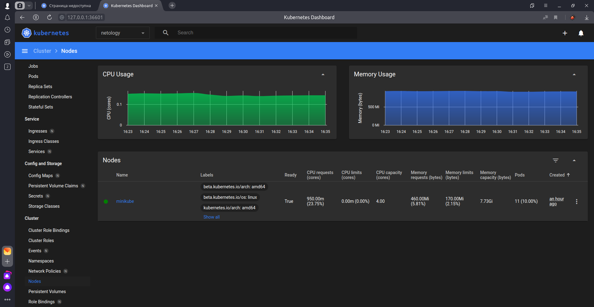

# Домашнее задание к занятию "12.1 Компоненты Kubernetes"

Вы DevOps инженер в крупной компании с большим парком сервисов. Ваша задача — разворачивать эти продукты в корпоративном кластере.

## Задача 1: Установить Minikube

Для экспериментов и валидации ваших решений вам нужно подготовить тестовую среду для работы с Kubernetes. Оптимальное решение — развернуть на рабочей машине Minikube.

<details>
<summary>### Как поставить на AWS:</summary>

- создать EC2 виртуальную машину (Ubuntu Server 20.04 LTS (HVM), SSD Volume Type) с типом **t3.small**. Для работы потребуется настроить Security Group для доступа по ssh. Не забудьте указать keypair, он потребуется для подключения.
- подключитесь к серверу по ssh (ssh ubuntu@<ipv4_public_ip> -i <keypair>.pem)
- установите миникуб и докер следующими командами:
  - curl -LO https://storage.googleapis.com/kubernetes-release/release/`curl -s https://storage.googleapis.com/kubernetes-release/release/stable.txt`/bin/linux/amd64/kubectl
  - chmod +x ./kubectl
  - sudo mv ./kubectl /usr/local/bin/kubectl
  - sudo apt-get update && sudo apt-get install docker.io conntrack -y
  - curl -Lo minikube https://storage.googleapis.com/minikube/releases/latest/minikube-linux-amd64 && chmod +x minikube && sudo mv minikube /usr/local/bin/
- проверить версию можно командой minikube version
- переключаемся на root и запускаем миникуб: minikube start --vm-driver=none
- после запуска стоит проверить статус: minikube status
- запущенные служебные компоненты можно увидеть командой: kubectl get pods --namespace=kube-system

### Для сброса кластера стоит удалить кластер и создать заново:
- minikube delete
- minikube start --vm-driver=none

Возможно, для повторного запуска потребуется выполнить команду: sudo sysctl fs.protected_regular=0

Инструкция по установке Minikube - [ссылка](https://kubernetes.io/ru/docs/tasks/tools/install-minikube/)

**Важно**: t3.small не входит во free tier, следите за бюджетом аккаунта и удаляйте виртуалку.

</details>

***Answer***

```
boliwar@netology:~$ minikube status
minikube
type: Control Plane
host: Running
kubelet: Running
apiserver: Running
kubeconfig: Configured
```



## Задача 2: Запуск Hello World
После установки Minikube требуется его проверить. Для этого подойдет стандартное приложение hello world. А для доступа к нему потребуется ingress.

- развернуть через Minikube тестовое приложение по [туториалу](https://kubernetes.io/ru/docs/tutorials/hello-minikube/#%D1%81%D0%BE%D0%B7%D0%B4%D0%B0%D0%BD%D0%B8%D0%B5-%D0%BA%D0%BB%D0%B0%D1%81%D1%82%D0%B5%D1%80%D0%B0-minikube)
- установить аддоны ingress и dashboard

***Answer***

```
boliwar@netology:~$ minikube addons list
|-----------------------------|----------|--------------|--------------------------------|
|         ADDON NAME          | PROFILE  |    STATUS    |           MAINTAINER           |
|-----------------------------|----------|--------------|--------------------------------|
| ambassador                  | minikube | disabled     | 3rd party (Ambassador)         |
| auto-pause                  | minikube | disabled     | Google                         |
| cloud-spanner               | minikube | disabled     | Google                         |
| csi-hostpath-driver         | minikube | disabled     | Kubernetes                     |
| dashboard                   | minikube | enabled ✅   | Kubernetes                     |
| default-storageclass        | minikube | enabled ✅   | Kubernetes                     |
| efk                         | minikube | disabled     | 3rd party (Elastic)            |
| freshpod                    | minikube | disabled     | Google                         |
| gcp-auth                    | minikube | disabled     | Google                         |
| gvisor                      | minikube | disabled     | Google                         |
| headlamp                    | minikube | disabled     | 3rd party (kinvolk.io)         |
| helm-tiller                 | minikube | disabled     | 3rd party (Helm)               |
| inaccel                     | minikube | disabled     | 3rd party (InAccel             |
|                             |          |              | [info@inaccel.com])            |
| ingress                     | minikube | enabled ✅   | Kubernetes                     |
| ingress-dns                 | minikube | disabled     | Google                         |
| istio                       | minikube | disabled     | 3rd party (Istio)              |
| istio-provisioner           | minikube | disabled     | 3rd party (Istio)              |
| kong                        | minikube | disabled     | 3rd party (Kong HQ)            |
| kubevirt                    | minikube | disabled     | 3rd party (KubeVirt)           |
| logviewer                   | minikube | disabled     | 3rd party (unknown)            |
| metallb                     | minikube | disabled     | 3rd party (MetalLB)            |
| metrics-server              | minikube | enabled ✅   | Kubernetes                     |
| nvidia-driver-installer     | minikube | disabled     | Google                         |
| nvidia-gpu-device-plugin    | minikube | disabled     | 3rd party (Nvidia)             |
| olm                         | minikube | disabled     | 3rd party (Operator Framework) |
| pod-security-policy         | minikube | disabled     | 3rd party (unknown)            |
| portainer                   | minikube | disabled     | 3rd party (Portainer.io)       |
| registry                    | minikube | disabled     | Google                         |
| registry-aliases            | minikube | disabled     | 3rd party (unknown)            |
| registry-creds              | minikube | disabled     | 3rd party (UPMC Enterprises)   |
| storage-provisioner         | minikube | enabled ✅   | Google                         |
| storage-provisioner-gluster | minikube | disabled     | 3rd party (Gluster)            |
| volumesnapshots             | minikube | disabled     | Kubernetes                     |
|-----------------------------|----------|--------------|--------------------------------|
```

```
boliwar@netology:~$ kubectl get pod,svc -n default
NAME                             READY   STATUS    RESTARTS      AGE
pod/hello-node-697897c86-4dj67   1/1     Running   2 (11m ago)   12m

NAME                 TYPE           CLUSTER-IP      EXTERNAL-IP   PORT(S)          AGE
service/hello-node   LoadBalancer   10.107.73.160   <pending>     8080:32354/TCP   10m
service/kubernetes   ClusterIP      10.96.0.1       <none>        443/TCP          30m
```

## Задача 3: Установить kubectl

Подготовить рабочую машину для управления корпоративным кластером. Установить клиентское приложение kubectl.
- подключиться к minikube
- проверить работу приложения из задания 2, запустив port-forward до кластера

***Answer***

```
boliwar@netology:~$ minikube service hello-node
|-----------|------------|-------------|---------------------------|
| NAMESPACE |    NAME    | TARGET PORT |            URL            |
|-----------|------------|-------------|---------------------------|
| default   | hello-node |        8080 | http://192.168.49.2:32354 |
|-----------|------------|-------------|---------------------------|
🎉  Opening service default/hello-node in default browser...
👉  http://192.168.49.2:32354
boliwar@netology:~$ curl -s http://192.168.49.2:32354
CLIENT VALUES:
client_address=172.17.0.1
command=GET
real path=/
query=nil
request_version=1.1
request_uri=http://192.168.49.2:8080/

SERVER VALUES:
server_version=nginx: 1.10.0 - lua: 10001

HEADERS RECEIVED:
accept=*/*
host=192.168.49.2:32354
user-agent=curl/7.81.0
BODY:
-no body in request-
```

## Задача 4 (*): собрать через ansible (необязательное)

Профессионалы не делают одну и ту же задачу два раза. Давайте закрепим полученные навыки, автоматизировав выполнение заданий ansible-скриптами. При выполнении задания обратите внимание на доступные модули для k8s под ansible.
 - собрать роль для установки minikube на YC сервисе (с установкой ingress)
 - собрать роль для запуска в кластере hello world

***Answer***

[ansible-playbook](https://github.com/dimsunv/devops-netology/tree/12-kubernetes-01-intro)

---
