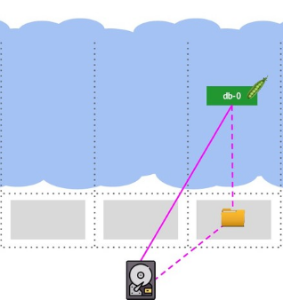

# Домашнее задание к занятию "12.3 Развертывание кластера на собственных серверах, лекция 1"
Поработав с персональным кластером, можно заняться проектами. Вам пришла задача подготовить кластер под новый проект.

## Задание 1: Описать требования к кластеру
Сначала проекту необходимо определить требуемые ресурсы. Известно, что проекту нужны база данных, система кеширования, а само приложение состоит из бекенда и фронтенда. Опишите, какие ресурсы нужны, если известно:

* База данных должна быть отказоустойчивой. Потребляет 4 ГБ ОЗУ в работе, 1 ядро. 3 копии.
* Кэш должен быть отказоустойчивый. Потребляет 4 ГБ ОЗУ в работе, 1 ядро. 3 копии.
* Фронтенд обрабатывает внешние запросы быстро, отдавая статику. Потребляет не более 50 МБ ОЗУ на каждый экземпляр, 0.2 ядра. 5 копий.
* Бекенд потребляет 600 МБ ОЗУ и по 1 ядру на копию. 10 копий.

План расчета
1. Сначала сделайте расчет всех необходимых ресурсов.
2. Затем прикиньте количество рабочих нод, которые справятся с такой нагрузкой.
3. Добавьте к полученным цифрам запас, который учитывает выход из строя как минимум одной ноды.
4. Добавьте служебные ресурсы к нодам. Помните, что для разных типов нод требования к ресурсам разные.
5. Рассчитайте итоговые цифры.
6. В результате должно быть указано количество нод и их параметры.

**Answer**

* База данных должна быть отказоустойчивой. Потребляет 4 ГБ ОЗУ в работе, 1 ядро. 3 копии.
* Кэш должен быть отказоустойчивый. Потребляет 4 ГБ ОЗУ в работе, 1 ядро. 3 копии.

Реализация нескольких подов БД и кэша в кластере не обеспечивают гарантии согласованности ([consistency](https://ru.wikipedia.org/wiki/%D0%A1%D0%BE%D0%B3%D0%BB%D0%B0%D1%81%D0%BE%D0%B2%D0%B0%D0%BD%D0%BD%D0%BE%D1%81%D1%82%D1%8C_%D0%B4%D0%B0%D0%BD%D0%BD%D1%8B%D1%85)), если речь идет bare metal, а реализация  механизма изоляции узла с целью защиты всего кластера от некорректной работы([Fencing](https://en.wikipedia.org/wiki/Fencing_(computing))) крайне сложна. Существует также множество Cloud Native решений, изначально ориентированных на выход из строя узлов, т.е. они сами умеют делать отказоустойчивость (failover) и восстановление узлов (recovery), предоставляют гарантии согласованности (consistency). Но из-за высоких задержек (latency) разместить нагруженную базу данных (например, MySQL, от которой требуется 50 тысяч IOPS) в облако не получится. 

Для примера реализация на классических СУБД в режиме StatefulSet. 

3 ноды, 1 под и сетевой высокоскоростной диск. При падении ноды кластер поднимает под на доступной ноде создает директорию и монтирует туда диск. Время простоя минимально, сonsistency и fencing соблюдены.

1. __Общая полезная нагрузка.__ Примем, что в требованиях указан максимум требующихся ресурсов.
  
    | Тип      | Количество под | Память на под (Mb) |  CPU на под | Итого памяти | Итого CPU |
    | :---:    |  :---:         |       :---:        |    :---:    |     :---:    |   :--:    |
    | БД       |        1       |       4096         |      1      |     4096    |     1     |
    | Кэш      |        1       |       4096         |      1      |     4096    |     1     |
    | Фронтенд |        5       |       50           |      0.2    |     250      |     1     |
    | Бэкенд   |        10      |       600          |      1      |     6000     |     10    |
    | __Итого__|      __17__    |        -           |      -      |   __14442__  |   __13__  |

2. __Выбор размера и количества нод.__ Поскольку требуется обеспечить отказоустойчивость для сервисов БД и кэша, то с этой точки зрения отдельных нод-воркеров должно быть не меньше трех. Таким образом для БД и кэша можно выделить 3 ноды по 2 СPU и 8 Гб ram. Для фронтенда и бэка 3 ноды 6 CPU и 8 ГБ ram
    
    | Тип ноды | Количество | CPU | Memory |
    | :---:    | :---: | :---: | :---: | 
    | master | 3 | 2 | 2 |
    | worker | 6 | 24 | 16 |