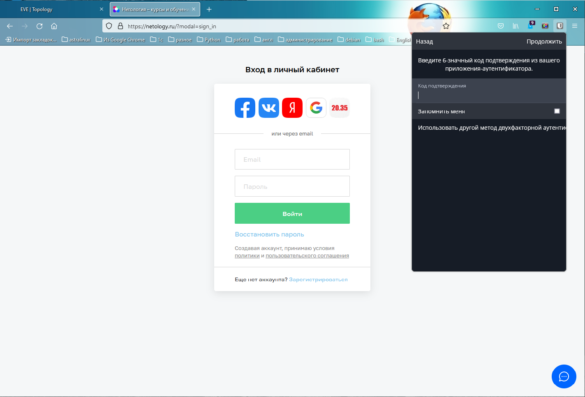

### Домашнее задание к занятию "3.9. Элементы безопасности информационных систем"

1. Установите Bitwarden плагин для браузера. Зарегистрируйтесь и сохраните несколько паролей.
    
2. Установите Google authenticator на мобильный телефон. Настройте вход в Bitwarden аккаунт через Google authenticator OTP.
    
3. Установите apache2, сгенерируйте самоподписанный сертификат, настройте тестовый сайт для работы по HTTPS.
    - Установка apache
    ```
    $ sudo apt install apache2
    ```
    - Создание виртуального хоста
    ```
    root@ubuntu-20:~# mkdir /var/www/test_site
    root@ubuntu-20:~# chown -R $USER:$USER /var/www/test_site
    root@ubuntu-20:~# chmod -R 755 /var/www/test_site
    root@ubuntu-20:~# nano /var/www/test_site/index.html
    root@ubuntu-20:~# cat /var/www/test_site/index.html
    <html>
        <head>
            <title>Welcome to Test site!</title>
        </head>
        <body>
            <h1>Success!  The test site virtual host is working!</h1>
        </body>
    </html>
    root@ubuntu-20:~# nano /etc/apache2/sites-available/test_site.conf
    root@ubuntu-20:~# cat /etc/apache2/sites-available/test_site.conf
    <VirtualHost *:80>
        ServerAdmin webmaster@localhost
        ServerName test_site
        ServerAlias www.test_site
        DocumentRoot /var/www/test_site
        ErrorLog ${APACHE_LOG_DIR}/error.log
        CustomLog ${APACHE_LOG_DIR}/access.log combined
    </VirtualHost>
    root@ubuntu-20:~# a2ensite test_site.conf
    Enabling site test_site.
    To activate the new configuration, you need to run:
      systemctl reload apache2
    root@ubuntu-20:~# a2dissite 000-default.conf
    Site 000-default disabled.
    To activate the new configuration, you need to run:
      systemctl reload apache2
    root@ubuntu-20:~# apache2ctl configtest
    AH00558: apache2: Could not reliably determine the server's fully qualified domain name, using 127.0.1.1. Set the 'ServerName' directive globally to suppress thige
    Syntax OK
    root@ubuntu-20:~# systemctl restart apache2
    ```
    - Генерация сертификата
    ```
    root@ubuntu-20:~# sudo openssl req -x509 -nodes -days 365 -newkey rsa:2048 -keyout /etc/ssl/private/apache-selfsigned.key -out /etc/ssl/certs/apache-selfsigned.crt
    Generating a RSA private key
    ..............................................................+++++
    ......+++++
    writing new private key to '/etc/ssl/private/apache-selfsigned.key'
    -----
    ```
    ```
    $ sudo nano /etc/apache2/conf-available/ssl-params.conf
    SSLCipherSuite EECDH+AESGCM:EDH+AESGCM:AES256+EECDH:AES256+EDH
    SSLProtocol All -SSLv2 -SSLv3 -TLSv1 -TLSv1.1
    SSLHonorCipherOrder On
    # Disable preloading HSTS for now.  You can use the commented out header line that includes
    # the "preload" directive if you understand the implications.
    # Header always set Strict-Transport-Security "max-age=63072000; includeSubDomains; preload"
    Header always set X-Frame-Options DENY
    Header always set X-Content-Type-Options nosniff
    # Requires Apache >= 2.4
    SSLCompression off
    SSLUseStapling on
    SSLStaplingCache "shmcb:logs/stapling-cache(150000)"
    # Requires Apache >= 2.4.11
    SSLSessionTickets Off
    ```
    ```
    $ sudo cp /etc/apache2/sites-available/default-ssl.conf /etc/apache2/sites-available/default-ssl.conf.bak
    $ root@ubuntu-20:~# nano /etc/apache2/sites-available/test_site-ssl.conf
    <IfModule mod_ssl.c>
            <VirtualHost *:443>
                    ServerAdmin your_email@example.com
                    ServerName www.test_site
    
                    DocumentRoot /var/www/test_site
    
                    ErrorLog ${APACHE_LOG_DIR}/error.log
                    CustomLog ${APACHE_LOG_DIR}/access.log combined
    
                    SSLEngine on
    
                    SSLCertificateFile      /etc/ssl/certs/apache-selfsigned.crt
                    SSLCertificateKeyFile /etc/ssl/private/apache-selfsigned.key
    
                    <FilesMatch "\.(cgi|shtml|phtml|php)$">
                                    SSLOptions +StdEnvVars
                    </FilesMatch>
                    <Directory /usr/lib/cgi-bin>
                                    SSLOptions +StdEnvVars
                    </Directory>
    
            </VirtualHost>
    </IfModule>
    ```
    ```shell
    $ sudo nano /etc/apache2/sites-available/test_site.conf
    <<VirtualHost *:80>
       # ServerAdmin webmaster@localhost
       # ServerName test_site
       # ServerAlias www.test_site
       # DocumentRoot /var/www/test_site
       # ErrorLog ${APACHE_LOG_DIR}/error.log
       # CustomLog ${APACHE_LOG_DIR}/access.log combined
       Redirect "/" "https://www.test_site/"
    </VirtualHost>
    ```
    ```
    $ sudo a2enmod ssl
    $ sudo a2enmod headers
    $ sudo a2ensite test_site-ssl
    $ sudo a2enconf ssl-params
    $ sudo apache2ctl configtest
    $ sudo systemctl restart apache2
    ```
    
